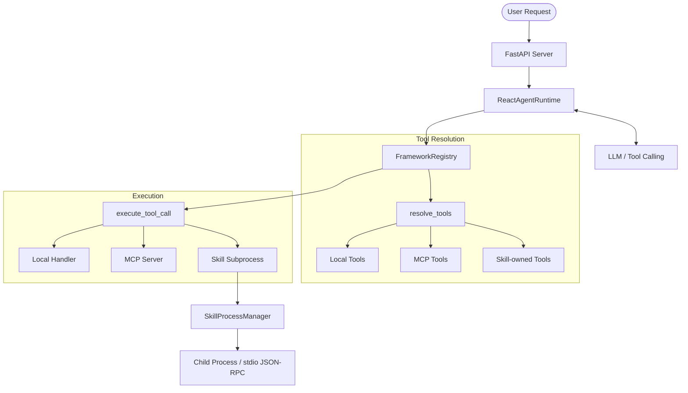

# Covalent - A Multi-UI Agentic Framework


Covalent is an agentic framework designed to bind autonomous agents together through seamless collaboration, much like the sharing of electrons in a covalent bond.

This is an agentic framework with subprocess-isolated skills, MCP integration, and ReAct-style execution.

## Features

- **Anthropic-style Skills** — `SKILL.md` is the primary skill format for model-facing instructions and compatible with Claude Code style skills
- **Execution Overrides via `skill.yaml`** — Optional runtime config for process, permissions, and tool wiring when a skill needs executable behavior
- **Sandboxed Execution** — Each skill runs as a separate process; permissions and environment are applied by the framework runner, with SDK support still available for custom RPC skills
- **Process Pool** — Long-running skill processes managed with semaphore-based concurrency control, health checks, and idle eviction
- **Ordinary Python & Node.js Scripts** — Export normal functions; the framework wraps them with a runner so skill authors do not need to implement JSON-RPC
- **OpenAI-Compatible LLM Providers** — Register provider endpoints in the Service Console; agents resolve models through persisted `openai_compatible` configs with env fallbacks
- **MCP Client** — Connect to external tool servers via stdio, SSE, or streamable HTTP
- **Multi-Agent Delegation** — Agents can delegate work to other registered agents
- **ReAct Runtime** — Iterative reasoning loop with tool calling, session history, and streaming SSE

## Quick Start

```bash
# Install dependencies
uv sync

# Configure (copy and edit .env)
cp env.example .env

# Run backend (requires AGENT_FRAMEWORK_DATABASE_URL)
uv run python main.py serve

# Or start backend + frontend together
./dev.sh both
```

The server starts on `http://0.0.0.0:5170` by default (`AGENT_FRAMEWORK_BACKEND_PORT`).

### Frontend

A Next.js control plane lives in [frontend](frontend).

```bash
cd frontend
pnpm install
pnpm dev
```

The frontend proxies the FastAPI backend and assumes `http://127.0.0.1:5170` by default. Override with `AGENT_FRAMEWORK_API_BASE_URL` or `NEXT_PUBLIC_AGENT_FRAMEWORK_API_BASE_URL`.

Service Console routes include agent settings, provider settings, MCP services, and skill settings under `frontend/app/service-console/`.

## Configuration

All settings are loaded from environment variables with the prefix `AGENT_FRAMEWORK_`, or from a `.env` file in the project root. In the `.env` file, use the full prefixed names (e.g. `AGENT_FRAMEWORK_DEFAULT_API_KEY`, not `DEFAULT_API_KEY`).

### Core Settings

| Variable | Default | Description |
|----------|---------|-------------|
| `AGENT_FRAMEWORK_DEFAULT_API_KEY` | — | Fallback LLM API key when no DB provider is configured |
| `AGENT_FRAMEWORK_DEFAULT_BASE_URL` | `https://api.openai.com/v1` | Fallback OpenAI-compatible base URL |
| `AGENT_FRAMEWORK_DEFAULT_MODEL` | `gpt-4o-mini` | Fallback model name |
| `AGENT_FRAMEWORK_DEFAULT_MAX_ITERATIONS` | `10` | Max ReAct loop iterations for seeded/default agents |
| `AGENT_FRAMEWORK_DATABASE_URL` | — | PostgreSQL connection string for persistent config |
| `AGENT_FRAMEWORK_SKILLS_ROOT_DIR` | `skills` | Managed root for built-in, uploaded, authored, and git-synced skills |
| `AGENT_FRAMEWORK_SKILLS_DIRECTORIES` | derived from `skills_root_dir` | Optional override for local skill scan roots |
| `AGENT_FRAMEWORK_BACKEND_PORT` | `5170` | Backend port used by `main.py serve` and `dev.sh` |
| `AGENT_FRAMEWORK_FRONTEND_PORT` | `3100` | Frontend dev port used by `dev.sh` |

See [env.example](env.example) for a starter `.env` template.

Prefer registering providers in the Service Console. The `DEFAULT_*` model variables above are fallbacks used when the `providers` table is empty or an agent inherits the default route without an explicit provider override.

### Persistent Config

Agents, MCP servers, skill sources, LLM providers, and chat sessions are stored in PostgreSQL and managed through the API or Service Console.

Optional `.env` JSON values are only used as first-boot seed data when the corresponding database tables are empty:

```bash
# .env
AGENT_FRAMEWORK_AGENTS_JSON=[{"name":"default","description":"Default agent","system_prompt":"You are a pragmatic assistant.","reasoning_prompt":"Think step by step when needed. Use tools only when they reduce uncertainty, then synthesize concise final answers from observations.","provider":{"provider":"openai_compatible","model":"gpt-4o-mini","base_url":"https://api.openai.com/v1","timeout_seconds":500.0},"skills":[],"local_tools":["get_current_time"],"capabilities":["chat","react","tool_calling","streaming"],"max_iterations":10}]
AGENT_FRAMEWORK_MCP_SERVERS_JSON=[]
AGENT_FRAMEWORK_SKILL_SOURCES_JSON=[]
```

Use `GET/PUT /config/agents`, `GET/PUT /config/mcp`, `GET/PUT /config/skill_sources`, and `GET/PUT /config/providers` to inspect and update persisted config.
Use `GET /providers/{provider_name}/models` to fetch the model catalog for a saved provider.

## Skills

### Directory Layout

All skills live under the managed `skills/` root:

```text
skills/
  built_in/       # repository-owned skills
  uploaded/       # user-imported local bundles
  authored/       # agent- or developer-authored bundles
  github_synced/  # git-backed synced bundles from DB skill_sources
```

The default skill format is:

```
my-skill/
  SKILL.md            # model-facing instructions and metadata
  src/
    main.py           # optional executable entry point
```

If a skill needs execution-specific configuration, add an optional `skill.yaml`:

```
my-skill/
  SKILL.md            # for the model
  skill.yaml          # for the execution environment
  src/
    main.py
```

`SKILL.md` is for the model.
- Instructions in the Markdown body are injected into the agent prompt.
- YAML frontmatter can define `name`, `description`, `version`, and `references`.

`skill.yaml` is for the runtime.
- Runtime type and protocol
- Permissions
- Process limits and timeouts
- Optional explicit tool-to-handler mappings

### `SKILL.md` Example

```md
---
name: weather-python
description: Fetch current weather for a city
version: "1.0.0"
references:
  - references/methodology.md
---

# Weather Skill

Use this skill when the user asks for current weather.
Call `get_weather` and present the result clearly.
```

### Optional `skill.yaml`

```yaml
runtime:
  type: python                    # "python" | "nodejs"
  protocol: callable              # "callable" | "rpc"
  entry_point: src/main.py        # relative to skill directory
  args: []                        # extra CLI args (optional)
  env: {}                         # static env vars (optional)

tools:                            # optional explicit tool declarations
  - name: my_tool
    handler: my_tool              # Python/JS function name for callable mode
    description: What it does
    parameters:
      type: object
      properties:
        query: { type: string, description: "Search query" }
      required: [query]

permissions:
  network:
    allow_outbound: ["*.example.com"]
    deny: []
  filesystem:
    read: ["${SKILL_DIR}/data"]
    write: ["${SKILL_DIR}/cache"]
  env_vars: ["API_KEY"]           # host env vars the skill may read
  subprocess: false               # can the skill spawn child processes?

process:
  max_instances: 1                # concurrent process pool size
  idle_timeout_seconds: 300       # evict idle processes after this
  startup_timeout_seconds: 15     # max time for process to become ready
  max_request_timeout_seconds: 60 # per-request timeout

health_check:
  interval_seconds: 30
  max_failures: 3
```

If `skill.yaml` is absent, the framework builds a default runtime config:
- It reads instructions from `SKILL.md`.
- It infers `src/main.py`, `main.py`, `src/main.js`, `main.js`, or `index.js` as the entry point when present.
- It treats top-level Python functions or exported Node.js functions as tools.
- It uses `callable` protocol automatically.

### Permission Enforcement

Permissions are enforced at two levels:

1. **Framework side** — Environment variables are filtered at spawn time; only declared `env_vars` and system essentials pass through.
2. **Runner / SDK side** — In `callable` mode the framework runner patches common filesystem entry points before loading the user module. In `rpc` mode the SDK provides the same guardrails. Network and subprocess restrictions are still exposed through environment variables for skill code to respect explicitly.

### Ordinary Python Skill Example

```python
def get_weather(city: str) -> str:
    """Get weather for a city."""
    import urllib.request
    url = f"https://wttr.in/{city}?format=3"
    req = urllib.request.Request(url, headers={"User-Agent": "curl/8"})
    with urllib.request.urlopen(req, timeout=10) as resp:
        return resp.read().decode().strip()
```

### Ordinary Node.js Skill Example

```js
async function hello_node({ name }) {
  return `Hello, ${name}!`;
}

module.exports = { hello_node };
```

### Using the SDK (optional)

If you want custom RPC behavior, dynamic tool registration, or framework-managed permission helpers inside the skill process, you can still use the SDK and set `runtime.protocol: rpc`.

```python
# src/main.py
import sys, os
sys.path.insert(0, os.path.dirname(__file__))
from skill_sdk import SkillServer

server = SkillServer()

@server.tool("greet")
def greet(name: str) -> str:
    """Greet someone."""
    return f"Hello, {name}!"

server.run()
```

The SDK auto-generates tool parameter schemas from function signatures and enforces declared permissions.

## API Reference

### Agent Endpoints

| Method | Path | Description |
|--------|------|-------------|
| `GET` | `/agents` | List all agents |
| `GET` | `/agents/{name}` | Get agent details |
| `POST` | `/agents/{name}/run` | Run agent (sync) |
| `POST` | `/agents/{name}/stream` | Run agent (SSE stream) |
| `POST` | `/v1/agent/invoke` | External production API for token-authenticated agent invokes |

**Run agent:**

```bash
curl -X POST http://localhost:5170/agents/default/run \
  -H "Content-Type: application/json" \
  -d '{"input": "What is the weather in Tokyo?"}'
```

**Stream agent:**

```bash
curl -N http://localhost:5170/agents/default/stream \
  -H "Content-Type: application/json" \
  -d '{"input": "Hello", "session_id": "abc123"}'
```

### Production Agent Invoke API

External callers should use the single public API surface:

```text
POST /v1/agent/invoke
Authorization: Bearer cvt_<token-prefix>_<secret>
Content-Type: application/json
```

API tokens are created and revoked in the Service Console under API Tokens. Each token is owned by one user and workspace, and can be constrained with a fine-grained policy:

```json
{
  "allowed_agents": ["researcher"],
  "allowed_memory_modes": ["none", "session"],
  "max_trace_level": "steps",
  "max_requests_per_minute": 60,
  "max_requests_per_day": 1000,
  "max_tokens_per_day": 200000
}
```

Supported policy fields:

| Field | Description |
|-------|-------------|
| `allowed_agents` | Optional allow-list of agent names this token can invoke |
| `allowed_memory_modes` | Optional allow-list containing `none`, `session`, or both |
| `max_trace_level` | Highest stream trace level: `none`, `steps`, or `debug` |
| `max_requests_per_minute` | Optional token-level burst limit enforced from invoke logs |
| `max_requests_per_day` | Optional token-level daily request quota enforced from invoke logs |
| `max_tokens_per_day` | Optional daily token quota using recorded `total_tokens` |

Stateless invoke does not write conversation memory:

```bash
curl -X POST http://localhost:5170/v1/agent/invoke \
  -H "Authorization: Bearer $COVALENT_API_TOKEN" \
  -H "Content-Type: application/json" \
  -d '{
    "agent": "researcher",
    "input": "Summarize the latest uploaded brief.",
    "memory": { "mode": "none" },
    "trace": { "level": "steps" }
  }'
```

Session invoke stores and reuses memory scoped to the token owner's user and workspace:

```bash
curl -X POST http://localhost:5170/v1/agent/invoke \
  -H "Authorization: Bearer $COVALENT_API_TOKEN" \
  -H "Content-Type: application/json" \
  -d '{
    "agent": "researcher",
    "input": "Continue from the prior analysis.",
    "memory": { "mode": "session", "session_id": "customer-brief-001" }
  }'
```

Set `stream: true` to receive Server-Sent Events. `trace.level` controls how much execution detail is exposed: `none` suppresses tool and thought events, `steps` emits redacted execution steps, and `debug` includes tool arguments and summarized results.

```bash
curl -N http://localhost:5170/v1/agent/invoke \
  -H "Authorization: Bearer $COVALENT_API_TOKEN" \
  -H "Content-Type: application/json" \
  -d '{
    "agent": "researcher",
    "input": "Inspect the configured tools before answering.",
    "stream": true,
    "memory": { "mode": "none" },
    "trace": { "level": "debug" }
  }'
```

Every public invoke writes an `agent_run_logs` row and an audit event. Denied calls, including missing or invalid tokens, cross-user private agent access, disallowed policy values, and quota failures, write `agent.invoke.denied` audit events when the request reaches the application.

### Skill Endpoints

| Method | Path | Description |
|--------|------|-------------|
| `GET` | `/skills` | List all skills |
| `GET` | `/skills/{name}` | Get skill details |
| `POST` | `/skills/install` | Install from local directory or register a git-backed skill source |
| `POST` | `/skills/upload` | Upload a `.zip` skill bundle into `skills/uploaded` or `skills/authored` |
| `DELETE` | `/skills/{name}` | Uninstall skill |
| `POST` | `/skills/{name}/start` | Pre-warm process pool |
| `POST` | `/skills/{name}/stop` | Stop process pool |
| `GET` | `/skills/{name}/health` | Check process health |

`/skills/install` accepts either a server-local directory path or a git source payload. `/skills/upload` accepts multipart form data with a `.zip` archive and a target category.

## Architecture



## Bundled Skills

Managed skills are organized under `skills/` by category:

```text
skills/
  built_in/       # repository-owned skills
  uploaded/       # user-imported local bundles
  authored/       # agent- or developer-authored bundles
  github_synced/  # git-backed synced bundles from DB skill_sources
```

Install or sync additional skills through the Service Console or the `/skills/install` and `/skills/upload` endpoints.

## Development

```bash
uv sync
uv run python main.py serve
./dev.sh both
cd frontend && pnpm install && pnpm exec tsc --noEmit
```
