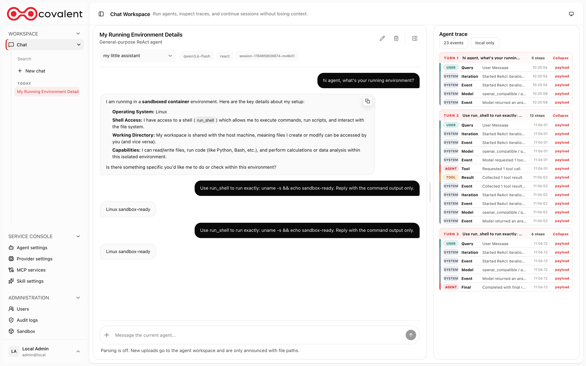
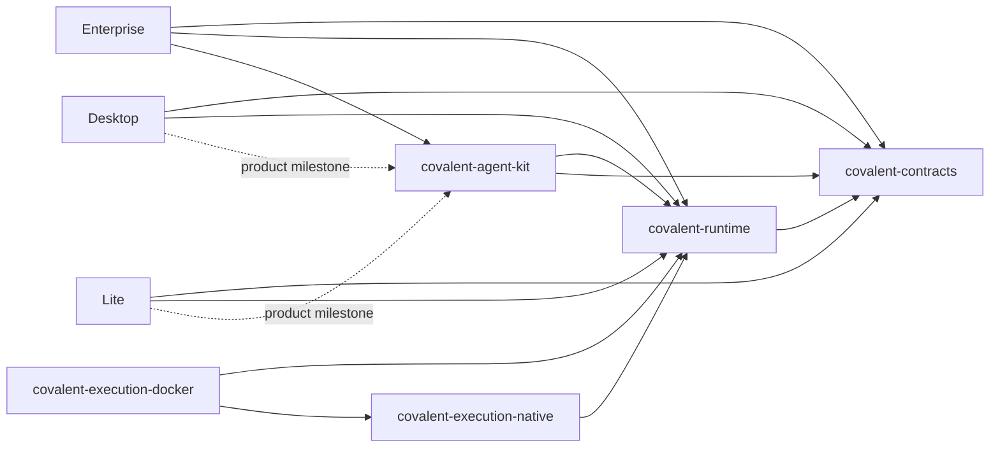

# Covalent

Run agents across server, desktop, and embedded deployments with one shared runtime.

<p align="center">
  
</p>


Covalent is an agent platform monorepo. Enterprise provides the complete control
plane and production API, Desktop brings the same agent model to macOS and
Windows, and Lite is the minimal server runtime for AI-native applications. All
products share contracts, execution semantics, tools, skills, and adapters
instead of maintaining separate agent engines.

<p align="center">
  
</p>

## Products

| Product | Purpose | Status | Documentation |
| --- | --- | --- | --- |
| **Enterprise** | FastAPI backend, PostgreSQL persistence, Next.js control plane, public invoke API, managed skills and sandboxes | Runnable full product | [Product README](products/enterprise/README.md) |
| **Desktop** | Local macOS/Windows workbench using Electron, React and a Python sidecar | Host/service foundation runnable; agent workspace and installers in progress | [Product README](products/desktop/README.md) |
| **Lite** | Small CLI-first agent server with a stable HTTP/SSE integration surface | Package scaffold; runtime product implementation next | [Product README](products/lite/README.md) |
| **Monitor** | Cross-product traces, evaluation and operational monitoring | Planned | [Architecture](docs/monorepo-architecture.md) |

Enterprise, Desktop, and Lite exchange the same agent, provider, MCP, skill and
message contracts. Product-specific authentication, storage, UI and deployment
remain inside each product.

## Capabilities

- ReAct execution with streaming, context compaction and delegation
- OpenAI-compatible model providers and MCP tool servers
- `SKILL.md` instructions with optional `skill.yaml` execution configuration
- Native Python/Node execution and Docker sandbox profiles
- Session history, durable run events and human-in-the-loop continuation
- Scoped `cvt_...` API tokens for production application integration
- Persistent Enterprise configuration and portable configuration bundles

## Repository layout

```text
covalent/
├── products/
│   ├── enterprise/        # FastAPI product, Next.js control plane, deployment
│   ├── desktop/           # Electron shell, React renderer, Python sidecar
│   └── lite/              # Minimal server product
├── packages/python/
│   ├── contracts/         # Serializable cross-product contracts
│   ├── runtime/           # Agent engine, domain types, ports and run services
│   ├── agent-kit/         # Registry, providers, MCP, skills and standard tools
│   ├── execution-native/  # Native process adapter and packaged runners
│   └── execution-docker/  # Docker execution adapter
├── skills/                # Built-in and locally managed skills
├── sandbox/               # Sandbox image definitions
├── tests/                 # Cross-package and Enterprise regression tests
├── docs/                  # Architecture, contracts and product guides
├── pyproject.toml         # uv workspace; the root is not a Python package
└── pnpm-workspace.yaml    # Enterprise and Desktop JavaScript workspace
```

The removed `covalent.*` compatibility package is no longer supported. Import
the owning package directly; see the [migration table](docs/legacy-python-imports.md).

## Quick start: Enterprise

Requirements: Python 3.12+, uv, Node.js 22+, pnpm, and PostgreSQL.

```bash
uv sync
pnpm install --frozen-lockfile
cp .env.example .env

# Apply schema changes explicitly, then start both services.
uv run python main.py migrate
./dev.sh both
```

- Control plane: `http://localhost:3100`
- Backend: `http://localhost:5170`
- Health: `http://localhost:5170/healthz`

`AGENT_FRAMEWORK_DATABASE_URL` must point to PostgreSQL. Environment variables
retain the `AGENT_FRAMEWORK_*` prefix for deployment compatibility. Provider and
agent configuration is persisted in the database and managed from the Service
Console.

See [Enterprise](products/enterprise/README.md) for authentication, public API,
configuration bundles, Docker deployment and operational details.

## Product development

Run commands from the repository root.

```bash
# Enterprise
./dev.sh both

# Desktop
uv sync --locked --all-packages
pnpm dev:desktop

# Package-only Lite work
uv sync --package covalent-lite
uv run --package covalent-lite python -c "import covalent_lite"
```

The root compatibility entry points `main.py`, `dev.sh`, `frontend/`, `alembic/`
and `Dockerfile` still target Enterprise. New code should use canonical product
paths and package names.

## Architecture


```mermaid
flowchart LR
    Enterprise[Enterprise] --> Contracts
    Desktop[Desktop] --> Contracts
    Lite[Lite] --> Contracts

    Enterprise --> Runtime
    Desktop --> Runtime
    Lite --> Runtime

    Runtime[covalent-runtime] --> Contracts[covalent-contracts]
    AgentKit[covalent-agent-kit] --> Runtime
    AgentKit --> Contracts
    Native[covalent-execution-native] --> Runtime
    Docker[covalent-execution-docker] --> Runtime
    Docker --> Native

    Enterprise --> AgentKit
    Desktop -. product milestone .-> AgentKit
    Lite -. product milestone .-> AgentKit
```

The enforced dependency rule is:

```text
product API → product application → shared runtime/contracts + product infra
```

Shared packages never import products, and products never import one another.
Architecture tests enforce package direction, including imports used only for
typing.

## Validation

```bash
uv run ruff check --select F \
  packages/python products/enterprise/backend/src \
  products/lite/service/src products/desktop/service/src \
  tests scripts main.py tooling
uv run python -m pytest tests/
uv build --all-packages --wheel
uv run python tooling/verify_wheels.py

pnpm typecheck
pnpm lint
pnpm build:enterprise
pnpm smoke:desktop
```

Set `TEST_DATABASE_URL` to a disposable PostgreSQL database to enable real-DB
integration tests. Docker integration and acceptance tests require a reachable
Docker daemon and locally built sandbox images.

## Documentation

- [Monorepo development guide](docs/development.md)
- [Architecture and product boundaries](docs/monorepo-architecture.md)
- [Runtime consistency rules](docs/runtime-consistency.md)
- [Desktop development guide](docs/products/desktop/development.md)
- [Lite development guide](docs/products/lite/development.md)
- [Lite API contracts](docs/products/lite/contracts.md)
- [Sandbox images](sandbox/README.md)

## License

MIT
