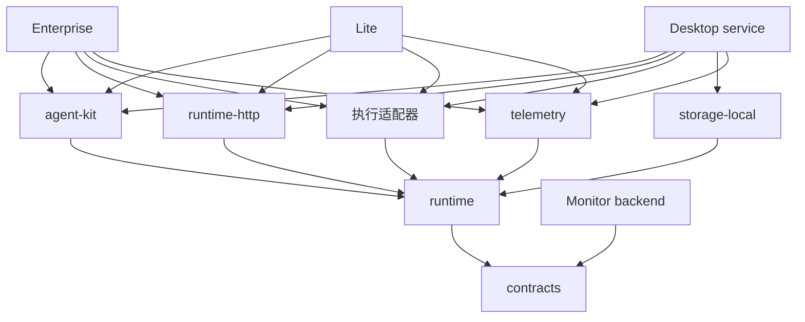

# Covalent Monorepo 产品与工程架构

状态：目标架构与分阶段实施计划；Enterprise/共享包已迁移，Lite 已建立包骨架，Desktop D1a 本地链路已运行，其余按阶段实施。
更新日期：2026-09-25

实施进展：Enterprise 及共享 Python 包的结构迁移见 [迁移记录](monorepo-migration.md)。本文其余产品与协议规划仍按阶段推进。

## 1. 决策摘要

采用一个 monorepo，维护 Enterprise、Lite、Desktop 三种运行产品，以及独立的 Monitor。共享运行内核与资产规范，各产品拥有自己的装配入口、部署产物、数据所有权和发布版本。

核心原则：

1. 产品之间不做源码依赖；共享能力通过包复用，跨进程通过版本化协议连接。
2. 产品负责身份、配置来源与基础设施装配；Runtime 负责执行语义。
3. Enterprise 保持当前体验与部署兼容，逐步抽离公共能力。
4. Monitor 独立运行，通过接入协议工作，不查询 Enterprise 的业务库。
5. 先划清模块边界，再按真实复用和依赖重量拆包；不一次创建全部规划目录。
6. 仓库统一开发不等于产品同步发布，也不等于生产环境安装整个仓库。

## 2. 产品边界

| 产品 | 核心职责 | 默认运行与存储方案（目标） | 不承担 |
| --- | --- | --- | --- |
| Enterprise | 团队 Agent 开发、管理、运行和生产接入；身份、权限、审计 | 服务部署、PostgreSQL；按策略选择执行后端 | 其他产品的启动依赖 |
| Lite | CLI-first Agent 运行，提供最小 HTTP/SSE 接口 | 单进程、文件配置、请求级无状态执行；无数据库 | 用户/组织管理、完整 UI、会话持久化、后台恢复 |
| Desktop | 个人 Agent 创建、调试、使用与本地资产管理 | Electron + React/Vite + Python sidecar；SQLite、本地执行（待实现） | 企业租户、常驻 Docker 的强制依赖 |
| Monitor | Trace 接入、查询、评测、风险分析与治理控制 | 独立 API、处理进程、存储和 Web UI | Agent 编排引擎、业务会话的权威存储 |

Lite/Desktop 没有用户管理，不等于关闭所有访问控制。Lite 默认本机监听；远端部署使用服务凭据或受信网关。Desktop sidecar 只接受桌面壳授权的本机访问。运行上下文使用通用 scope 标识，Enterprise 将用户/租户映射为 scope，不要求其他产品创建虚拟企业用户。

Lite 首版配置以文件为唯一来源，启动时形成快照；CLI 与 API 共用执行用例，不依赖 SQLite 或持久运行服务。详细边界见 [Lite 开发指南](products/lite/development.md)。Desktop 的 SQLite 仍是待实现的选择，不是切换现有 PostgreSQL 连接串即可获得的能力。持久任务、多副本调度和恢复另行设计。

## 3. 目标目录

下面是逐步到达的目标。仅为当前开发建立包骨架；其余目录在对应实现启动时创建，避免空应用堆积。

```text
covalent/
├── products/
│   ├── enterprise/
│   │   ├── backend/              # Python 包 covalent_enterprise
│   │   │   ├── pyproject.toml
│   │   │   ├── src/covalent_enterprise/
│   │   │   │   ├── api/
│   │   │   │   ├── application/
│   │   │   │   ├── infra/
│   │   │   │   └── bootstrap.py  # 装配入口
│   │   │   ├── migrations/       # Enterprise 现有数据与迁移历史
│   │   │   └── tests/
│   │   ├── web/                  # 当前 Next.js 前端
│   │   └── deploy/               # 镜像、部署清单、运行说明
│   ├── lite/
│   │   ├── service/              # covalent_lite：API、CLI、装配
│   │   ├── tests/
│   │   └── deploy/
│   ├── desktop/
│   │   ├── shell/                # 原生窗口、更新、sidecar 生命周期
│   │   ├── web/                  # React UI，独立路由和宿主适配
│   │   ├── service/              # covalent_desktop：本地 API 与 OS 集成
│   │   ├── tests/
│   │   └── packaging/            # 各 OS 构建、签名、安装与升级
│   └── monitor/
│       ├── backend/              # covalent_monitor
│       │   ├── src/covalent_monitor/
│       │   │   ├── ingestion/
│       │   │   ├── query/
│       │   │   ├── evaluation/
│       │   │   ├── governance/
│       │   │   └── infra/
│       │   ├── migrations/
│       │   └── tests/
│       ├── web/
│       └── deploy/
├── packages/
│   ├── python/
│   │   ├── contracts/            # covalent-contracts / covalent_contracts
│   │   ├── runtime/              # covalent-runtime / covalent_runtime
│   │   ├── agent-kit/            # covalent-agent-kit / covalent_agent_kit
│   │   ├── storage-local/        # SQLite 配置、会话、运行与事件适配器
│   │   ├── execution-native/     # 本地进程和文件访问实现
│   │   ├── execution-docker/     # Docker 实现，可选依赖
│   │   ├── telemetry/            # 事件映射、过滤、导出
│   │   ├── runtime-http/         # 共享执行 HTTP/SSE 路由适配器
│   │   └── client/               # 公共远程调用 SDK
│   └── typescript/
│       ├── client/               # @covalent/client：公共调用与 SSE
│       ├── ui/                   # @covalent/ui：tokens、基础组件
│       ├── agent-workbench/      # 编辑器、Chat、Trace 等可复用模块
│       └── telemetry/            # 第三方 JS Agent 接入 SDK，按需建设
├── contracts/
│   ├── generated/               # JSON Schema/OpenAPI 派生产物，禁止手改
│   ├── examples/                # 有效/无效/历史版本协议样例
│   └── compatibility/           # 协议兼容矩阵
├── tests/
│   ├── architecture/            # Python/TS 依赖边界与包隔离
│   ├── contracts/               # 跨语言和版本兼容
│   ├── cross-product/           # Enterprise → Lite/Desktop 资产流转
│   └── fixtures/                # 不含凭据的跨产品样例
├── assets/
│   ├── brand/
│   └── skills/built_in/         # 仅仓库维护的技能源文件
├── tooling/                     # schema 生成、构建、CI 影响分析
├── docs/
│   ├── adr/                     # 经确认的架构决策
│   └── monorepo-architecture.md
├── .github/workflows/           # 若采用 GitHub Actions，在此实现门禁
├── pyproject.toml              # uv workspace 与共享开发工具配置
├── uv.lock
├── package.json
├── pnpm-workspace.yaml
├── pnpm-lock.yaml
└── AGENTS.md
```

每个 Python 包都包含自己的 `pyproject.toml`、`src/<独立命名空间>/` 和 `tests/`。每个 TS 包包含自己的 manifest、exports、构建配置和测试。独立命名空间避免多个 wheel 同时写入当前 `covalent/` 目录造成安装冲突。

早期不建立统一 worker 产品。Enterprise 和 Monitor 的后台任务先属于各自后端；确有独立扩缩容需求时，以同一产品包的另一入口部署。

## 4. 包边界与依赖方向

下图箭头表示“导入/依赖”。



### 4.1 contracts：稳定的可交换数据

包含可移植 Agent manifest、配置引用、消息、运行事件、错误码、执行能力声明与控制命令的线格式。允许轻量 schema 依赖；不引用 Runtime、FastAPI、SQLAlchemy、Docker、模型 SDK 和产品模块。

Python 模型是这些公共数据结构的唯一源头，生成根目录 `contracts/generated/` 下的 JSON Schema；公共 HTTP OpenAPI 在共享适配器建成后由 `runtime-http` 导出；当前仍由产品 API 生成。产品私有管理 API 由产品后端导出到各自命名目录。TS 类型从对应产物生成，禁止维护第二份公共字段定义。

数据库模型、Enterprise 管理 DTO、Python 执行对象和协议模型各有用途，不把整个 `application/schemas.py` 移入 contracts。

### 4.2 runtime：执行语义和端口

先用一个 Runtime 包，在包内划分 `domain/`、`engine/`、`ports/`、`services/`：

- domain：Run、Session、ToolCall、执行状态、领域异常。
- engine：ReAct、上下文压缩、委派、输入等待与恢复语义。
- ports：Model、ToolResolver、ExecutionBackend、RunStore、EventStore、MemoryStore、ArtifactStore、PolicyEvaluator、EventSink 等按实际用例提取的接口。
- services：共享运行生命周期与取消、恢复等用例，不包含组织或 HTTP 语义。

Runtime 不读取全局配置、不连接具体数据库、不自行发现产品模块；依赖由构造函数注入。类型检查专用 import 也遵守边界。不要先拆 `core/context/memory/registry` 四五个紧密耦合包；等有独立消费者或依赖需求再拆。

当前 `core` 中 shell、PDF、browser 工具属于具体工具实现，不属于未来的纯领域层。

### 4.3 agent-kit：标准 Agent 能力组合

包含现有 registry、Skill 发现/加载/进程管理、MCP 集成、OpenAI-compatible 模型适配和内置工具，负责实现 Runtime 端口。内部保留 `models/`、`mcp/`、`skills/`、`tools/` 分区。

重型文档、浏览器能力用可选 extras 和延迟导入，Lite 的最小安装不拉入 Playwright、PDF/Office 工具链。该包不依赖 FastAPI、企业身份或 PostgreSQL。继续维持 `openai_compatible` 对外 Provider 类型，不因目录调整增加新的配置种类。

### 4.4 adapters、runtime-http 与产品装配

- execution-native / execution-docker 实现相同执行端口；Docker SDK 只在 Docker 包中。
- Desktop 首先在产品 infra 内实现 SQLite 与迁移；storage-local 保留为未来真实复用时的提取方向，Lite 首版不依赖它。Enterprise 保留当前 PostgreSQL 实现和迁移历史；第二个真实消费者需要 PostgreSQL 时再抽共享适配器。
- runtime-http 仅负责公共执行 API 的参数、异常、SSE 转换；调用 Runtime 用例，身份/鉴权由宿主注入。不得因“共享路由”引入用户库和管理逻辑。
- 产品 bootstrap 选择适配器、解析凭据与配置并装配运行服务。API/CLI → application → runtime/infra 的产品内部规则继续保留。
- Enterprise 审计、权限、配额在产品用例层执行；Runtime 工具级策略通过通用 PolicyEvaluator 注入，避免绕过 API 后失去执行策略。

禁止产品互相 import；Desktop 不启动 `covalent_lite`，两者复用相同包。禁止公共包出现 `if enterprise` 或读取产品 edition 的分支。

## 5. 前端共享边界

Enterprise 保持 Next.js 与当前 Chat Workspace / Service Console。Desktop 单独拥有路由、窗口和宿主 API；无需复制 Next.js 服务端和企业登录流程。

| 范围 | 归属 |
| --- | --- |
| 色彩、间距、圆角、基础表单与 panel | @covalent/ui |
| Agent 编辑、Skill 预览、聊天渲染、Trace 展示 | @covalent/agent-workbench，通过 props/services 注入数据 |
| 公共 invoke、运行控制、SSE 解析 | @covalent/client |
| 用户管理、发布审核、组织审计、企业导航 | Enterprise web |
| 本地目录授权、文件选择、系统凭据、更新 | Desktop shell/service 与宿主 bridge |
| 跨运行 Trace 检索、评测和治理页面 | Monitor web |

共享组件禁止导入 Next.js 路由、企业 auth context、桌面 IPC、固定后端地址。工作台内部可以有明确的能力模型，但不以 edition 判断按钮。先抽纯展示和状态模型，已有单一消费者的页面继续留在产品内。

Desktop 已采用 Electron + React/Vite + Python sidecar，支持 macOS/Windows；理由与验证条件见 [ADR 0001](adr/0001-desktop-stack.md)。开发态窗口、握手、鉴权与正常退出已在 macOS 跑通；Python 冻结、异常进程树回收及双平台安装升级仍须验证。开发路径见 [Desktop 开发指南](products/desktop/development.md)。

## 6. 资产、配置与数据所有权

### 6.1 两类导出并存

- `covalent-config`：现有平台迁移包，保留 Enterprise 用户、workspace、配置和现有版本行为。
- `covalent-agent`：新建可移植资产包，包含 manifest、固定版本/摘要的技能文件、依赖引用、模型要求、执行能力要求、所需凭据名称。默认不含密钥、用户、成员关系或数据库主键。

Desktop 及后续 Lite 资产工具可导入 Enterprise 导出的可移植包；Lite 首版先支持已部署的配置文件，ZIP 导入不作为交付前提。兼容历史整站包时，使用显式转换命令提取 Agent 子集，报告无法迁移的用户/租户/审核字段；不在 Lite 加入企业用户表来兼容导入。

导入流程为：校验格式与路径 → 解析依赖 → 检查能力与版本 → 绑定本地凭据 → 展示差异/验证 → 原子提交。要求 Docker 的资产在 native-only 环境中明确报不支持，不能静默降级。ZIP 路径穿越和依赖缺失必须有失败用例。

可移植包声明“需要哪些能力”，目标环境决定“允许哪些能力”。包内权限要求不能提升目标环境权限。签名、来源信任与依赖锁定字段预留扩展，首版先完成摘要与可重复验证。

### 6.2 唯一配置来源与迁移所有者

Enterprise 的数据库配置仍是唯一权威来源。Lite 首版使用文件配置，加载凭据引用后形成不可变快照，修改后重启；Desktop 使用自己的本地配置仓库。各产品 CLI 与 API 调同一用例，不并行维护文件与数据库两套可变权威。

环境变量用于部署选项、凭据绑定或兼容 seed，不作为新的资产持久化方式。保留 `AGENT_FRAMEWORK_*`，未来改名需明确兼容期和冲突优先级。

| 数据 | 权威所有者 | 迁移所有者 |
| --- | --- | --- |
| Enterprise 用户、workspace、配置、会话、运行 | Enterprise DB | Enterprise backend |
| Lite 首版配置 | 部署配置文件；请求状态仅内存 | Lite 配置格式版本 |
| Desktop 本地配置、会话、运行 | 各实例本地 DB，互不共享文件 | Desktop infra；未来按需提取 storage-local |
| Monitor Trace、评测、治理记录 | Monitor DB | Monitor backend |
| Agent 可移植文件 | 版本化资产包 | contracts 格式转换器 |

Enterprise 的现有 Alembic revision、表名、主键保持连续，不为搬目录重建数据库。迁移命令由产品明确调用。若以后抽共享 PostgreSQL 包，必须同时明确其表和迁移所有权，不能让两个迁移器管理同一张表。

仓库 `assets/skills/built_in` 只放发布资产；uploaded/authored/github_synced、会话文件、SQLite、缓存和凭据都属于产品数据目录，不写入源码包。现有 skills 路径迁移需兼容配置并保留 enabled 状态。

## 7. Monitor 与 Runtime 的契约

### 7.1 执行事件与遥测分开

支持持久运行的产品将执行事件用于 UI 重放、恢复与状态一致性并负责持久化；Lite 首版事件只在请求内流转，不承诺重放或恢复。Telemetry 是执行事件的可过滤、可采样投影。Monitor 不在线时，执行与重放仍正常；丢失遥测不等于丢失任务状态。

建议事件信封包含 `schema_version`、`event_id`、`source_id`、`run_id`、`parent_run_id`、`sequence`、`timestamp`、`event_type`、`payload`。Trace/span 与租户关联按字段扩展；Monitor 以接入凭据确定租户，不信任客户端自报租户作为鉴权依据。

sequence 只保证单运行内顺序，跨 Agent 通过父子关系连接。导出按至少一次投递设计，Monitor 以 `(source_id, event_id)` 去重，支持乱序与缺失标记。SDK 具备有界缓冲、批量发送、退避、磁盘队列可选项和明确丢弃计数。敏感字段在出口过滤，默认不导出凭据和完整工具 payload。

第三方 Agent 可直接用协议或 SDK 接入，无需安装 Runtime。Python telemetry 内部将通用 client 与 Runtime EventSink adapter 分开；其基础安装只依赖 contracts，Runtime adapter 为可选 extra。后续 OpenTelemetry 映射单独定义，不能宣称现有 SSE 就是通用遥测标准。

### 7.2 治理控制是另一条通道

Monitor 的异步风险发现不能承诺阻断已经执行的动作。同步工具准入由本地 PolicyEvaluator 执行，加载版本化策略，返回 allow / deny / require_approval。

远程取消、审批或恢复通过运行产品公开的控制 API 下发，携带 command ID、目标运行、过期时间、预期状态和调用者权限。产品端做授权、幂等、状态竞争检查并记录结果；Monitor 不直接修改运行库。纯观测第三方接入显示“不支持控制”。

网络中断时观测继续缓冲；需要强制治理的操作默认拒绝或等待，按明确策略决定。Monitor 不拥有业务执行权威，运行产品仍负责最终执行与审计。

## 8. 构建、版本与发布

Python 采用 uv workspace，JS/TS 采用 pnpm workspace，根目录各一个锁文件。每个成员声明自己的运行依赖；产品构建只安装该产品的依赖闭包。现有 Hatchling 可以继续使用，不将打包器更换绑在架构迁移上。

uv 的 workspace 共享解析和锁文件，不能自动阻止未声明的 Python import，因此需要独立安装测试；成员依赖将来若无法统一解析，可在同一仓库内拆出独立 workspace，而非被迫拆 Git 仓库。参考：[uv workspaces](https://docs.astral.sh/uv/concepts/projects/workspaces/)、[pnpm workspaces](https://pnpm.io/workspaces)。

| 版本对象 | 策略 |
| --- | --- |
| Python 公共包 | 初期同一 release train 降低组合复杂度，每包仍有 manifest 和依赖范围 |
| Enterprise / Lite / Desktop / Monitor | 独立版本、tag、changelog 与发布流程 |
| Agent / 运行事件 / 控制协议 | 各自 schema version，与产品版本分离 |
| 对外 SDK | 按协议兼容性发布，不绑定某个产品 UI 版本 |
| UI/workbench | 初期私有 workspace 包，不强制公开 registry |

建议 tag 如 `enterprise/v0.x.y`、`lite/v0.x.y`、`desktop/v0.x.y`、`monitor/v0.x.y`、`packages/v0.x.y`。每个产品 release manifest 固定实际包版本、源码 commit、协议支持范围与资产摘要。同一锁文件用于当前源码开发；历史产品产物依靠其发布快照复现。

公共包先构建 wheel/SDK 产物，干净环境验证后，再构建受影响产品。不能依赖 editable 安装或开发机路径才能启动。是否对外发布到 registry 是单独决策，初期可内部制品分发。

公共协议新增可选字段保持兼容，破坏性变更提升 major。首个稳定协议发布后，维护当前与上一支持版本的 fixture/适配测试；不支持的 major 导入前失败。旧包不得被新产品静默重新解释。

## 9. CI、测试与维护规则

CI 按改动包和反向依赖闭包运行，不能只按产品目录判断。锁文件、根构建配置或影响图无法确定时扩大验证范围。

| 改动 | 必须验证 |
| --- | --- |
| contracts / Runtime | 自身测试、三产品运行契约、Monitor 协议、生成差异 |
| agent-kit / execution adapter | 受影响能力测试、实际使用该能力的产品 |
| storage-local | SQLite 迁移、Desktop 数据与生命周期测试 |
| runtime-http / SDK | API/SSE 契约、消费者与断线重连用例 |
| UI / workbench | 类型、lint、共享组件及消费者构建 |
| 产品私有代码 | 产品测试、构建和相应跨产品契约 |
| Monitor 私有实现 | 接入/查询/控制契约、DB 迁移，不要求发布其他产品 |

必设门禁：

1. Python AST 和 TS import 规则：产品禁止互引，公共包禁止导入产品，Runtime 禁止导入具体 infra/API；涵盖 TYPE_CHECKING。动态插件只能通过明确的注册接口。
2. 包安装隔离：从 wheel 安装 runtime 与最小 Lite，在干净环境执行 smoke test；没有 FastAPI/SQLAlchemy/Docker SDK 的环境中可导入 Runtime。
3. 资产流转：Enterprise 导出后，Lite/Desktop 执行同一 fixture；覆盖缺凭据、能力不支持、禁用 Skill、历史版本。
4. 运行语义：按产品能力验证；Lite 验证流式事件、断连取消、超时与清理，持久产品另测重放、等待输入、恢复、重复控制命令和状态竞争。
5. 迁移：现有 Enterprise 数据升级；SQLite 创建与升级；Monitor 自己的数据升级。
6. Monitor 隔离：不可达、重试、重复事件、乱序，不损害执行事件持久化；第三方不安装 Runtime 也能接入。
7. 发行环境：发布前跑目标 OS 的 Desktop 安装/升级/sidecar 清理，容器产品跑启动与健康检查。

事件持久化与后台 asyncio task 不等于进程崩溃后自动恢复。新的生命周期契约必须定义 interrupted 状态、恢复点及工具幂等；在恢复保证实现前，清晰标记能力不支持。

每个包 README 必须说明职责、公开 API、允许依赖、维护角色和测试入口。CODEOWNERS 按角色/实际成员配置；公共契约变更需维护者和至少一个受影响产品维护者评审。新增包须有独立消费者、依赖隔离或发布需求之一，禁止无归属的 `common/utils` 包。

## 10. 当前代码的迁移映射

| 当前路径 | 目标归属 | 迁移注意事项 |
| --- | --- | --- |
| core/types.py、core/agent.py | contracts + runtime/domain | 区分线格式、配置与执行对象，不能整文件硬搬 |
| runtime/react.py、context_window_manager.py、delegation.py | runtime/engine | 移除 application 异常与具体存储依赖 |
| runtime/memory_port.py | runtime/ports + 产品存储适配 | 当前 Protocol 与 SessionStore adapter 同文件，先分开 |
| runtime/run_manager.py | runtime/services + Enterprise infra | 生命周期与 SQLAlchemy 操作拆开，先保持现有表与 SSE |
| runtime/backend.py | runtime/ports + contracts | 从 Docker 专用 SandboxSpec 区分通用能力与实现配置 |
| runtime/filesystem_backend.py、docker_backend.py | execution-native / execution-docker | 保持执行绑定、工作目录和进程清理语义 |
| registry/、skills/、mcp/、model/ | agent-kit 内部模块 | 具体 factory 在装配处选择，不反向依赖 Runtime 实现 |
| core/*_tools.py、attachment_processing.py | agent-kit/tools | 重依赖可选安装 |
| application/services/agent_invocation.py | Runtime 用例 + Enterprise 用例 | 执行与 Principal、run log、审计分开 |
| api/、application/、infra/、cli/ 的企业能力 | Enterprise backend | 保持路由、权限与命令兼容 |
| config_bundle_service.py / schema.py | Enterprise；抽可移植资产转换 | 整站迁移包继续支持，不替换原格式 |
| frontend/ | Enterprise web，渐进提取 TS 包 | 产品路由、代理和身份留在 Enterprise |
| alembic/ | Enterprise backend/migrations | 保留历史 revision 和现有升级路径 |
| tests/ | 包内、产品内、根跨产品测试 | 先保持旧测试入口，再迁移归属 |

## 11. 实施阶段与退出条件

### M0：确认边界与基线

完成本文评审，记录关键 ADR；采集现有测试与构建基线，冻结需要保持的 API/SSE/CLI 样例。明确 Lite 首版能力集合，以及 Desktop 首发 OS。现有命令不变。

退出条件：职责、契约归属、首个验证场景明确，可区分已有缺陷与重构回归。

### M1：在原目录内拆依赖

先分离 memory port/adapter、运行状态存储、领域异常与企业审计。新增边界测试；保持 `src/covalent`、数据库和前端位置。新旧实现通过同一入口切换，避免双写和两套配置路径。

退出条件：Runtime 在测试替身端口下执行、流式输出、委派和取消；现有 Enterprise 测试保持基线。

### M2：落地 workspace 与最小共享包

抽 contracts、runtime、agent-kit 与执行适配器；建立 uv workspace。随后迁移 Enterprise 目录、构建脚本和前端 pnpm workspace；机械移动与行为修改分 PR。旧 `covalent.*` import、`main.py`、`dev.sh` 通过有期限的单向兼容 shim 保持入口，公共包绝不依赖 shim。

退出条件：Enterprise 从独立产物启动并对现有数据库完成迁移验证；干净环境可安装公共包；锁文件与 CI 包边界生效。旧 `agent-framework` 分发名的退役作为显式兼容事项处理。

### M3：Lite 验证完整复用链

先实现文件配置、validate/agents/run CLI，再接入最小 HTTP/SSE 接口。单进程无状态，不依赖企业身份或数据库。复用 contracts/runtime/agent-kit，验证一个含工具的完整任务以及限额、断连、超时和资源清理。公共 DTO 按实际需要抽取；runtime-http、资产 ZIP 导入与持久化不作为首版前提。

退出条件：Enterprise 与 Lite 共享同一执行引擎和公共调用契约子集；没有复制企业业务代码；最小依赖安装通过。CLI/API 功能开发顺序见 [Lite 开发指南](products/lite/development.md)。

### M4：Desktop 与 Monitor 分别迭代

Desktop 抽 UI/workbench 并实现本地宿主；Monitor 从事件 SDK、接入和 Trace 查询开始，再做评测与控制。遥测契约的设计及 fixture 在 M1–M3 就开展，不等 UI 建成后补协议。

退出条件：Desktop 可离线启动和导入 Agent、正确回收 sidecar；Monitor 独立部署并接入 Covalent 与一个第三方测试生产者；断开 Monitor 不影响 Agent 运行。

### M5：独立发布与兼容维护

完善产品 release manifest、升级测试和兼容矩阵；按真实需求提取更多适配器或 SDK。兼容 shim 只有在调用方完成迁移且有明确退役版本后删除。

退出条件：一次产品私有 UI 修改可独立发布；一次共享 Runtime 修改能识别、测试所有消费者而不强制同时发布。

## 12. 暂不锁定的决策

- Desktop 已确定 Electron 开发方向与 macOS/Windows 目标；最低系统版本、CPU 架构覆盖、Python 打包方式及自动更新渠道经发行原型验证后确定。
- Monitor 大规模存储/队列技术：先以查询、吞吐与保留需求评估，不提前引入分布式组件。
- 开源与商业许可划分：沿用现有许可，变更另行决策；目录边界不构成仓库访问隔离。
- 对外包名与 registry：本文为仓库内逻辑命名，发布前核实可用性。
- 多副本调度、远程沙箱与第三方控制：具备端口后按产品需求实现，不预先声称支持。

这些决策可以独立推进，不阻塞共享内核、资产契约和数据边界落地。
