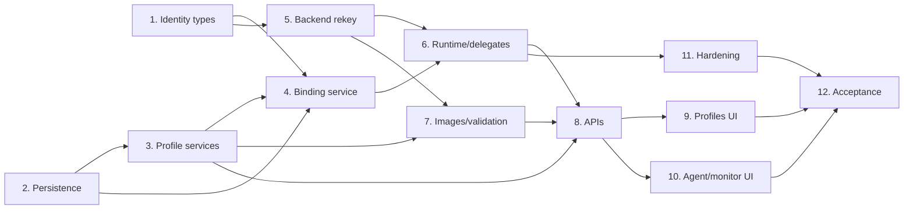

# Per-agent sandbox profiles — Implementation Plan

**Branch:** `codex/per-agent-sandbox-profiles`

**Source spec:**
`docs/superpowers/specs/2026-08-15-per-agent-sandbox-profiles-design.md`

**Goal:** Allow each agent to select an administrator-approved Docker sandbox
profile, run master/delegate agents in separate containers, and give all agents in
one execution scope cooperative access to the same filesystem workspace.

**Architecture:** Persist sandbox profiles and logical sandbox bindings, resolve a
binding for every master/delegate run through an application-layer service, carry
an explicit execution target in `RunContext`, and key Docker containers plus skill
process pools by `sandbox_instance_id`. Persistent chats use `session_id` as their
execution scope; stateless public invokes use `run_id` and clean up in `finally`.

**Delivery strategy:** Land the change in narrow, reversible slices. The first
runtime milestone supports multiple instances using the existing default image.
Profile CRUD, image variants, and UI arrive only after execution identity and
lifecycle are proven.

## Global constraints

- Preserve the dependency rule `api -> application -> (core, runtime, infra)`.
- Application services must not import FastAPI, `covalent.api.*`, or `app.state`.
- Database-backed profile and binding rows are the source of truth. Environment
  values only seed the compatibility default.
- Do not silently fall back to filesystem execution when Docker is unavailable.
- Preserve the existing session workspace location and host-absolute bind targets
  in this delivery.
- `workspace_scope_id` is a filesystem lifecycle key; existing database
  `workspace_id` remains the tenant/organization identifier.
- A delegate inherits conversation/execution/workspace scope but never its
  parent's `sandbox_instance_id`.
- Profile configuration cannot expose arbitrary Docker flags, volumes, devices,
  privileged mode, host networking, or Docker socket access.
- Existing agents with `sandbox_profile_id = NULL` must continue to run.
- `memory.mode=none` must not create a fake `chat_sessions` row.
- Run focused tests after every task. Run the full backend/frontend gates only
  after the owning slice is green.

## Recommended commit sequence

| Commit | Slice | Expected state |
|---|---|---|
| 1 | Design and execution value types | No behavior change |
| 2 | Profile/binding persistence | Migration and repositories green |
| 3 | Profile and binding application services | Framework-independent orchestration green |
| 4 | Instance-keyed execution backend | Existing default image, multi-container runtime green |
| 5 | Delegate and stateless-run integration | Master/delegate and public invoke lifecycle green |
| 6 | Profile/image validation and image variants | Python/Node real-Docker smoke green |
| 7 | Backend APIs and management contracts | HTTP/CRUD/import-export green |
| 8 | Service Console UI | TypeScript/lint and manual UI flow green |
| 9 | Hardening, observability, docs | Full validation green |

Commits are suggested review boundaries; do not combine a failing intermediate
slice with unrelated cleanup.

---

## Task 0: Establish the baseline and protect unrelated work

**Files:**

- Add: `docs/superpowers/specs/2026-08-15-per-agent-sandbox-profiles-design.md`
- Add: `docs/superpowers/plans/2026-08-15-per-agent-sandbox-profiles.md`

**Steps:**

- [ ] Confirm the branch is `codex/per-agent-sandbox-profiles`.
- [ ] Record `git status --short`; preserve any unrelated user changes.
- [ ] Run the current focused sandbox tests before changing code:

  ```bash
  uv run python -m pytest \
    tests/test_docker_backend.py \
    tests/test_sandbox_admin_api.py \
    tests/test_shell_tools.py \
    tests/test_workspace_access.py
  ```

- [ ] Run the application import-boundary guard:

  ```bash
  uv run python -m pytest tests/test_application_boundary.py
  ```

- [ ] Record existing failures as baseline; do not fix unrelated failures in this
  feature branch.

**Suggested commit:** `docs: design per-agent sandbox profiles`

---

## Task 1: Introduce execution identity value types

**Files:**

- Modify: `src/covalent/runtime/backend.py`
- Modify: `src/covalent/core/types.py`
- Modify: `src/covalent/runtime/filesystem_backend.py`
- Create/modify: `tests/test_execution_backend.py`
- Modify: `tests/test_filesystem_backend.py`

**Interfaces produced:**

```python
@dataclass(frozen=True)
class ExecutionTarget:
    execution_scope_id: str
    session_id: str | None
    workspace_scope_id: str
    sandbox_instance_id: str
    agent_name: str


@dataclass(frozen=True)
class SandboxSpec: ...


@dataclass(frozen=True)
class SandboxBinding:
    target: ExecutionTarget
    spec: SandboxSpec
    allowed_outbound: tuple[str, ...]
```

Extend `RunContext` with optional `execution_scope_id`, `workspace_scope_id`, and
`sandbox_instance_id` fields.

**Steps:**

- [ ] Write serialization/copy tests for the new `RunContext` fields.
- [ ] Write equality/immutability tests for execution value objects.
- [ ] Add the types without changing the existing backend method signatures yet.
- [ ] Add no-op compatibility helpers to `FileSystemBackend` where needed.
- [ ] Verify all legacy context construction remains valid.

**Validation:**

```bash
uv run python -m pytest tests/test_execution_backend.py tests/test_filesystem_backend.py
uv run python -m pytest tests/test_application_boundary.py
```

**Suggested commit:** `refactor: separate sandbox execution identity from sessions`

---

## Task 2: Add profile and logical-instance persistence

**Files:**

- Modify: `src/covalent/infra/db.py`
- Create: `src/covalent/infra/sandbox_repository.py`
- Modify: `src/covalent/infra/agent_repository.py`
- Modify: `src/covalent/infra/config_store.py`
- Create: `alembic/versions/<revision>_add_sandbox_profiles_and_instances.py`
- Create: `tests/test_sandbox_repository.py`
- Modify: real-DB migration/integration tests where available

**Schema:**

- `sandbox_profiles`
- nullable `agents.sandbox_profile_id`
- `sandbox_instances` with nullable chat-session FK and non-null
  `execution_scope_id`
- unique `(execution_scope_id, agent_name)`

**Steps:**

- [ ] Write model/repository tests for profile round-trip and revision fields.
- [ ] Write binding tests for persistent `scope_kind=session`.
- [ ] Write binding tests for transient `scope_kind=run` with no chat-session row.
- [ ] Add DB rows and constraints.
- [ ] Add repository methods for profile CRUD, reference counts, candidate updates,
  binding get-or-create, list-by-scope, delete-by-scope, and last-used updates.
- [ ] Add `sandbox_profile_id` to `PersistedAgentConfig` and agent repository
  read/write paths.
- [ ] Add Alembic upgrade and downgrade operations with the repository's existing
  idempotency conventions.
- [ ] Confirm `ON DELETE CASCADE` removes session-scoped bindings.
- [ ] Confirm profile deletion is restricted while agents or bindings reference it.

**Validation:**

```bash
uv run python -m pytest tests/test_sandbox_repository.py
uv run python -m pytest tests/test_agent_crud_api.py -q
uvx ruff check --select F src/ main.py
```

Run real-DB tests with `TEST_DATABASE_URL` when a PostgreSQL test database is
available.

**Suggested commit:** `feat: persist sandbox profiles and execution bindings`

---

## Task 3: Build framework-independent profile services

**Files:**

- Modify: `src/covalent/application/schemas.py`
- Modify: `src/covalent/application/errors.py`
- Create: `src/covalent/application/services/sandbox_profile_service.py`
- Modify: `src/covalent/application/services/management_service.py`
- Modify: `src/covalent/application/services/runtime_apply_service.py`
- Modify: `src/covalent/core/agent.py`
- Modify: `src/covalent/registry/registry.py`
- Create: `tests/test_sandbox_profile_service.py`
- Modify: `tests/test_agent_crud_api.py`
- Modify: `tests/test_skill_config_mcp_api.py`

**Steps:**

- [ ] Add application request/response models for profile list/detail/create/update.
- [ ] Add typed errors for inaccessible, disabled, unvalidated, referenced,
  incompatible, and validation-unavailable profiles.
- [ ] Implement profile input validation:
  - non-empty image and command;
  - known runtime capabilities;
  - positive resource values;
  - operator hard-limit checks;
  - parsed registry allowlist checks.
- [ ] Implement one-default-per-availability-scope behavior.
- [ ] Implement candidate revision semantics: runtime-affecting changes to an
  enabled profile validate before atomic activation.
- [ ] Add the bootstrap-only `legacy_unverified` default seeded from current Docker
  settings when no profile exists.
- [ ] Add `sandbox_profile_id` to `AgentSpec`, management normalization,
  import/export, and runtime registry construction.
- [ ] Validate agent skill runtimes against profile capabilities at save time.
- [ ] Keep filesystem backend profile selection inert but persisted.
- [ ] Re-run the application import guard.

**Validation:**

```bash
uv run python -m pytest tests/test_sandbox_profile_service.py
uv run python -m pytest tests/test_skill_config_mcp_api.py tests/test_agent_crud_api.py -q
uv run python -m pytest tests/test_application_boundary.py
```

**Suggested commit:** `feat: add sandbox profile application services`

---

## Task 4: Build the sandbox binding service

**Files:**

- Create: `src/covalent/application/services/sandbox_binding_service.py`
- Modify: `src/covalent/application/services/agent_invocation.py`
- Modify: `src/covalent/application/services/session_service.py`
- Modify: `src/covalent/runtime/base.py` or a small runtime port module
- Create: `tests/test_sandbox_binding_service.py`

**Responsibilities:**

- derive `execution_scope_id` and `workspace_scope_id`;
- resolve default/explicit profile;
- validate profile state and agent compatibility;
- get-or-create one logical binding for `(execution_scope_id, agent_name)`;
- return the saved spec snapshot for existing bindings;
- re-evaluate `allowed_outbound` and request recreation when it changes;
- configure the backend without eagerly creating a container;
- reset one instance;
- clean an entire persistent or transient scope.

**Steps:**

- [ ] Define an async `ExecutionBindingResolver` protocol visible to runtime code
  without importing the application package.
- [ ] Write a concurrent get-or-create test that simulates the unique-constraint
  winner/loser path.
- [ ] Write a pinning test: edit profile revision, then resolve an existing binding
  and assert the saved spec remains unchanged.
- [ ] Write an outbound change test that requests recreation without replacing the
  profile snapshot.
- [ ] Write a run-scope cleanup test that deletes bindings/private-state references
  without requiring a `chat_sessions` row.
- [ ] Implement the service with repositories and backend injected explicitly.
- [ ] Move session deletion sandbox orchestration into the application service;
  routes should no longer call backend lifecycle directly.

**Validation:**

```bash
uv run python -m pytest tests/test_sandbox_binding_service.py
uv run python -m pytest tests/test_application_boundary.py
```

**Suggested commit:** `feat: resolve immutable sandbox bindings per agent and scope`

---

## Task 5: Rekey Docker execution by sandbox instance

**Files:**

- Modify: `src/covalent/runtime/backend.py`
- Modify: `src/covalent/runtime/docker_backend.py`
- Modify: `src/covalent/runtime/filesystem_backend.py`
- Modify: `src/covalent/runtime/docker_process.py` if identity is logged there
- Modify: `src/covalent/skills/process.py`
- Modify: `src/covalent/core/shell_tools.py`
- Modify: `src/covalent/skills/meta_tools.py`
- Modify: `tests/test_docker_backend.py`
- Modify: `tests/test_filesystem_backend.py`
- Modify: `tests/test_shell_tools.py`

**Steps:**

- [ ] Change backend registration to `configure(binding)` and active maps to
  `sandbox_instance_id` keys.
- [ ] Add a per-instance `asyncio.Lock`; double-check container existence after
  acquiring it.
- [ ] Make `_create_container()` consume the binding's image, command, resources,
  agent metadata, and outbound snapshot.
- [ ] Add instance/profile/execution-scope labels and collision-safe names.
- [ ] Mount the same `workspace_scope_id` directory into sibling containers.
- [ ] Add an instance-private HOME/cache directory and per-container `/tmp` tmpfs.
- [ ] Implement `stop_instance`, `stop_scope`, and session compatibility wrapper.
- [ ] Make capacity accounting count every active container and release once per
  stopped instance.
- [ ] Rekey `SkillProcessManager` pools/semaphores/handles by
  `sandbox_instance_id`.
- [ ] Add `stop_sandbox_instance()` process eviction before container teardown.
- [ ] Route shell and skill script execution using context instance identity.
- [ ] Keep filesystem backend semantics unchanged.

**Required tests:**

- [ ] Same session, two instance IDs, two images -> two containers.
- [ ] Both container configs use the same workspace host source.
- [ ] HOME, tmpfs, container name, labels, and process pools remain distinct.
- [ ] Concurrent ensure creates one container.
- [ ] Stop one leaves the sibling alive.
- [ ] Stop scope removes all and releases all capacity slots.
- [ ] Outbound change recreates only the affected instance.

**Validation:**

```bash
uv run python -m pytest \
  tests/test_docker_backend.py \
  tests/test_filesystem_backend.py \
  tests/test_shell_tools.py \
  tests/test_workspace_access.py
uvx ruff check --select F src/ main.py
```

**Suggested commit:** `refactor: isolate docker execution by sandbox instance`

---

## Task 6: Integrate master, delegate, and stateless invocation lifecycle

**Files:**

- Modify: `src/covalent/runtime/react.py`
- Modify: `src/covalent/application/services/agent_invocation.py`
- Modify: `src/covalent/application/services/invoke_service.py`
- Modify: `src/covalent/api/routes/agents.py`
- Modify: `src/covalent/api/routes/public.py`
- Modify: `src/covalent/api/_shared.py`
- Modify: `src/covalent/api/app.py`
- Modify/create: delegate runtime and public invoke tests

**Steps:**

- [ ] Inject `ExecutionBindingResolver` into `ReactAgentRuntime` during app wiring.
- [ ] Resolve a binding at the start of every master and delegate run, while
  retaining lazy container creation.
- [ ] Update delegate context to inherit `execution_scope_id` and
  `workspace_scope_id`, but clear `sandbox_instance_id`.
- [ ] Remove `_record_sandbox_session()` calls from FastAPI routes.
- [ ] For persistent runs, set `execution_scope_id=session_id`.
- [ ] For `memory.mode=none`, set `execution_scope_id=run_id` and keep
  `session_id=None` for memory semantics.
- [ ] Add cancellation-safe `finally` cleanup for stateless run scopes, including
  streaming client disconnect.
- [ ] Update the reaper to enumerate instance summaries rather than bare session
  IDs.
- [ ] Add execution/profile metadata to delegate and tool trace events.

**Required integration tests:**

- [ ] Master A and delegate B receive distinct instance IDs.
- [ ] Two calls to the same delegate in one scope reuse its logical binding.
- [ ] Nested delegation keeps the same scope and gets per-agent instances.
- [ ] Model-only delegates do not create containers.
- [ ] Stateless invoke cleans container, process handles, binding, private state,
  and temporary workspace on success, error, timeout, and cancellation.
- [ ] Persistent session idle stop retains its logical binding.

**Validation:**

```bash
uv run python -m pytest tests/test_agent_react.py -q
uv run python -m pytest tests/test_public_invoke_api.py -q
uv run python -m pytest tests/test_sandbox_admin_api.py -q
uv run python -m pytest tests/test_application_boundary.py
```

**Suggested commit:** `feat: run delegated agents in independent sandboxes`

---

## Task 7: Implement image contract, validation, and image variants

**Files:**

- Keep/modify: `Dockerfile.sandbox`
- Add: a clearly named Node sandbox Dockerfile/build target
- Optionally add: a polyglot sandbox Dockerfile/build target
- Add/modify: `.github/workflows/sandbox-image.yml`
- Modify: `src/covalent/runtime/docker_backend.py`
- Create: `src/covalent/runtime/sandbox_image_validator.py`
- Create: `tests/test_sandbox_image_validator.py`
- Modify: real-Docker smoke scripts/tests

**Steps:**

- [ ] Preserve `Dockerfile.sandbox` as the compatibility Python image.
- [ ] Add Node image with `/bin/sh`, `node`, and `/runners/node_runner.js`.
- [ ] Ensure declared runtimes match binaries and runner files actually installed.
- [ ] Implement pull policy: `never`, `if_not_present`, `always`.
- [ ] Implement validation in a short-lived, network-disabled, mount-free container
  with entrypoint overridden.
- [ ] Probe shell, runtime binaries, runner files, keepalive behavior, and image
  identity; sanitize all failures.
- [ ] Persist validation status/digest through the profile service.
- [ ] Verify a `legacy_unverified` bootstrap profile can run and becomes `valid`
  after explicit validation.
- [ ] Add/update image matrix CI without silently changing the existing tag's
  runtime contents.

**Validation:**

```bash
uv run python -m pytest tests/test_sandbox_image_validator.py tests/test_docker_backend.py
docker build -t covalent-sandbox:dev -f Dockerfile.sandbox .
# Build the new Node target with its documented command.
```

Run the real-Docker master-Python/delegate-Node shared-file smoke from the spec.

**Suggested commit:** `feat: validate and publish python and node sandbox images`

---

## Task 8: Add backend profile and instance APIs

**Files:**

- Create: `src/covalent/api/routes/sandbox_profiles.py`
- Modify: `src/covalent/api/routes/ops.py`
- Modify: `src/covalent/api/routes/agents.py`
- Modify: `src/covalent/api/app.py` or router registration
- Modify: `src/covalent/application/schemas.py`
- Create: `tests/test_sandbox_profile_api.py`
- Modify: `tests/test_sandbox_admin_api.py`
- Modify: `tests/test_agent_crud_api.py`
- Modify: management import/export tests

**Endpoints:**

```text
GET    /sandbox/profiles
GET    /sandbox/profiles/{id}
POST   /sandbox/profiles
PUT    /sandbox/profiles/{id}
POST   /sandbox/profiles/{id}/validate
POST   /sandbox/profiles/{id}/enable
POST   /sandbox/profiles/{id}/disable
DELETE /sandbox/profiles/{id}

GET    /sandbox/status
DELETE /sandbox/instances/{id}
POST   /sandbox/instances/{id}/reset
DELETE /sandbox/sessions/{session_id}
```

**Steps:**

- [ ] Add thin routes and typed application-to-HTTP error mapping.
- [ ] Enforce admin authority for profile mutations.
- [ ] Apply workspace visibility without leaking inaccessible IDs.
- [ ] Round-trip `sandbox_profile_id` through agent CRUD/detail and management
  import/export.
- [ ] Group status snapshot by execution scope/session and include profile revision,
  agent, image identity, network mode, and resources.
- [ ] Make stop-instance keep the logical binding; make reset remove it.
- [ ] Record audit events for profile mutation/validation/disable and instance
  stop/reset.

**Validation:**

```bash
uv run python -m pytest \
  tests/test_sandbox_profile_api.py \
  tests/test_sandbox_admin_api.py \
  tests/test_agent_crud_api.py
uv run python -m pytest tests/test_application_boundary.py
```

**Suggested commit:** `feat: expose sandbox profile and instance management APIs`

---

## Task 9: Add frontend contracts and Sandbox Profiles workspace

**Files:**

- Modify: `frontend/lib/types.ts`
- Modify: `frontend/lib/client-api.ts`
- Create: `frontend/components/sandbox-profiles-workspace.tsx`
- Create: `frontend/app/service-console/sandbox-profiles/page.tsx`
- Modify: `frontend/components/app-sidebar.tsx`
- Reuse: `frontend/app/globals.css` and existing panel/form primitives

**Steps:**

- [ ] Mirror backend profile, validation, reference-count, and instance DTOs exactly.
- [ ] Add client helpers for profile CRUD, validation, enable/disable, and default.
- [ ] Build the profile list/detail form with existing Service Console patterns.
- [ ] Show enabled/default/validation badges, capabilities, resource limits, image
  digest, references, and active instance count.
- [ ] Do not expose unsupported Docker options in the form.
- [ ] Add confirmations for disable/delete and preserve server error detail.
- [ ] Show a clear warning for `legacy_unverified`.
- [ ] Preserve standard workspace width and current light visual language.

**Validation:**

```bash
cd frontend
pnpm exec tsc --noEmit
pnpm lint
```

Manually verify create -> validate -> enable -> default -> disable/delete conflict.

**Suggested commit:** `feat: add sandbox profile management workspace`

---

## Task 10: Add Agent selector and multi-instance monitoring UI

**Files:**

- Modify: `frontend/components/agents-workspace.tsx`
- Modify: `frontend/components/sandbox-workspace.tsx`
- Modify: `frontend/lib/types.ts`
- Modify: `frontend/lib/client-api.ts`
- Modify: `frontend/app/globals.css` only when shared primitives are insufficient

**Steps:**

- [ ] Add `sandbox_profile_id` to agent form state, sample/starter normalization,
  serialization, dirty checking, and save payload.
- [ ] Place the profile selector near `allowed_outbound`.
- [ ] Show profile capabilities and pre-save compatibility warnings.
- [ ] When backend is filesystem, state that the selection is saved but inactive.
- [ ] Change Sandbox monitoring from one flat row per session to session/scope groups
  with nested instances.
- [ ] Show agent, profile/revision, capabilities, image/digest, activity, network,
  resource usage, stop, and reset.
- [ ] Preserve the existing responsive desktop-first Service Console layout.
- [ ] Verify long image names and multiple instances do not cause horizontal page
  overflow.

**Validation:**

```bash
cd frontend
pnpm exec tsc --noEmit
pnpm lint
```

Manual flow: configure Python master + Node delegate, run a delegation, then verify
both nested instance rows and independent actions in Sandbox monitoring.

**Suggested commit:** `feat: select and monitor per-agent sandbox profiles`

---

## Task 11: Shared-workspace hardening and observability

**Files:**

- Modify: `src/covalent/runtime/docker_backend.py`
- Modify: `src/covalent/core/workspace_tools.py`
- Modify: trace/activity builders in `src/covalent/runtime/react.py`
- Modify: `src/covalent/api/routes/ops.py`
- Modify: relevant tests and operational docs

**Steps:**

- [ ] Change managed skill source mounts from `rw` to `ro` and run all built-in
  skill tests.
- [ ] Use atomic replacement for supported built-in workspace write operations.
- [ ] Add an in-process path lock for cooperative built-in writes; document that
  arbitrary shell/third-party writes remain non-transactional.
- [ ] Set instance-private HOME/XDG/pip/npm cache environment.
- [ ] Add operator hard maximums and parsed registry allowlist settings.
- [ ] Add execution scope, instance, agent, profile revision, and image identity to
  logs/traces/admin snapshots.
- [ ] Add counters for validation, pulls, active instances, reset/recreate, and
  capacity waits without using unbounded metric labels.
- [ ] Ensure UI/help text accurately states that current `allowed_outbound` is not a
  hard shell destination allowlist.

**Validation:**

```bash
uv run python -m pytest \
  tests/test_workspace_access.py \
  tests/test_docker_backend.py \
  tests/test_shell_tools.py \
  tests/test_skill_config_mcp_api.py
```

**Suggested commit:** `hardening: isolate sandbox state and shared workspace writes`

---

## Task 12: Full regression, real-Docker acceptance, and rollout docs

**Files:**

- Modify: `README.md`
- Modify: `docs/execution-backend-design.md`
- Modify/add: Docker smoke scripts and CI workflow
- Update: source spec status after acceptance

**Steps:**

- [ ] Run the complete backend test suite:

  ```bash
  uv run python -m pytest tests/
  uvx ruff check --select F src/ main.py
  ```

- [ ] Run frontend gates:

  ```bash
  cd frontend
  pnpm exec tsc --noEmit
  pnpm lint
  ```

- [ ] Run real-Docker acceptance:
  - Python master and Node delegate use different container IDs/images.
  - They exchange a file through one shared workspace.
  - HOME/cache/tmp remain isolated.
  - Stopping one leaves the sibling alive.
  - Session deletion removes all sibling containers/private state.
  - Stateless invoke cleans its full run scope on completion and cancellation.
  - Empty outbound lists keep both containers on `network_mode=none`.
- [ ] Restart the backend and confirm logical bindings recreate containers lazily.
- [ ] Verify default-profile seed behavior from an upgraded database.
- [ ] Verify migration downgrade on a disposable database.
- [ ] Document Docker build/pull/digest workflow, capacity sizing, profile admin
  flow, shared-write semantics, and the current outbound enforcement boundary.
- [ ] Update the spec status from Proposed only after acceptance criteria pass.

**Suggested commit:** `docs: finalize sandbox profile rollout and operations`

---

## Dependency graph



## Milestones and stop/go gates

### Milestone A — Runtime identity foundation

Tasks 1-6 complete. Stop/go gate:

- existing default image still works;
- master/delegate container identity is separated;
- shared workspace works;
- stateless cleanup is proven;
- no UI/profile image choice required yet.

### Milestone B — Configurable environments

Tasks 7-8 complete. Stop/go gate:

- Python and Node profiles validate;
- agent configuration round-trips profile selection;
- backend APIs enforce authority and compatibility;
- real-Docker cross-runtime smoke passes.

### Milestone C — Operator-ready product

Tasks 9-12 complete. Release gate:

- Service Console supports the full workflow;
- monitoring and cleanup are instance-aware;
- hardening and accurate security messaging are present;
- complete backend/frontend and real-Docker acceptance pass.

## Definition of done

- All acceptance criteria in the source spec pass.
- The Alembic migration is reversible on a disposable database.
- Backend and frontend contracts match exactly.
- No application-layer boundary violations are introduced.
- Existing filesystem and single-default-profile behavior remain compatible.
- No container/process/private-state leaks occur on stop, reset, session deletion,
  stateless completion, or cancellation.
- Documentation describes both the supported collaboration model and its shared
  write/outbound-security limitations accurately.
