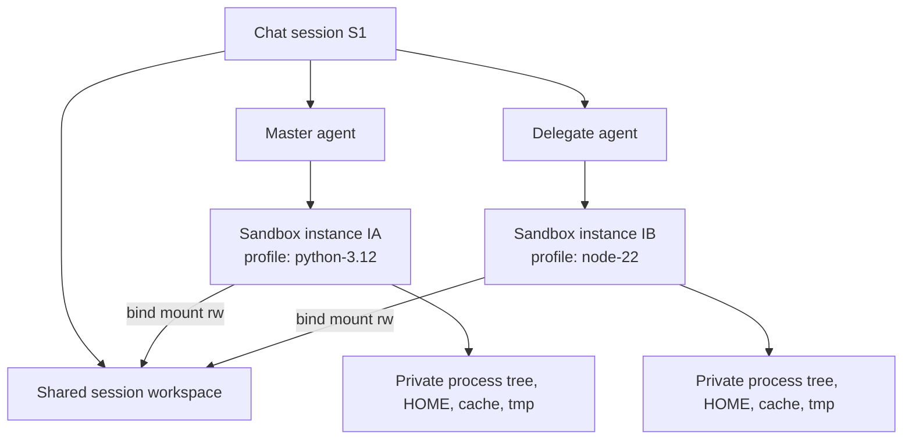

# Design: Per-agent sandbox profiles and multi-sandbox sessions

**Date:** 2026-08-15
**Status:** In review — implementation on `codex/per-agent-sandbox-profiles`, all
tasks and three review rounds addressed; awaiting final release review before
marking Implemented.
**Scope:** Add administrator-managed Docker sandbox profiles, allow each agent to
select a profile, and allow a master agent and its delegated agents to run in
different containers while sharing the same session workspace.

## Summary

Covalent currently has one Docker image configured for the whole process and one
container for each chat session. Delegated agents inherit the master's `session_id`,
so their skills, scripts, and shell commands all execute in that same container.

This design separates five identities that are currently collapsed into
`session_id`:

- `session_id`: optional conversation, memory, and activity owner.
- `execution_scope_id`: lifecycle group for one persistent chat session or one
  stateless public invocation.
- `workspace_scope_id`: filesystem shared by collaborators; in v1 this equals
  `execution_scope_id`.
- `sandbox_instance_id`: one logical execution environment owned by one agent in
  one execution scope.
- `sandbox_profile_id`: administrator-approved environment template used to create
  the container.

`workspace_scope_id` is deliberately distinct from the repository's existing
database `workspace_id`, which means tenant/organization ownership and remains
unchanged throughout this design.

The resulting runtime topology is:



The v1 workspace policy is deliberately simple: all agents participating in the
same session receive read/write access to the same session workspace. Container
filesystems, processes, environment, HOME, cache, and `/tmp` remain isolated. A
future private/read-only workspace policy can be added without changing the
identity model.

## Background and current constraints

### Global image and resource configuration

`AppSettings` currently exposes a single set of Docker settings:

```python
execution_backend_docker_image = "covalent-sandbox:dev"
execution_backend_docker_mem_limit = "512m"
execution_backend_docker_pids_limit = 256
execution_backend_docker_cpus = 1.0
execution_backend_docker_network = "none"
execution_backend_docker_tmpfs_size = "128m"
```

`DockerBackend.__init__` copies these values to process-global fields, and
`_create_session_container()` uses them for every container. The backend therefore
cannot choose an image or resource shape per agent or per session.

### One session maps to one container

`DockerBackend` currently uses:

```python
self._sessions: dict[str, Container]  # keyed by session_id
name = f"covalent-sandbox-{safe(session_id)}"
```

All lifecycle and observability methods (`ensure`, `exec`, `spawn_stream`, `stop`,
`is_alive`, idle tracking, and the reaper) use `session_id` as the container key.

### Delegates inherit the session

`ReactAgentRuntime._build_delegate_context()` intentionally inherits the parent's
`session_id` so delegate traces and memory remain part of the same conversation.
That behavior must remain. What must change is the execution identity carried next
to the conversation identity.

### Skill processes use the same isolation key

`SkillProcessManager` pools processes by `(skill_name, session_id)`. Even if the
Docker backend learned to create two containers for a session, the current pool
could still return a process from the wrong container. The pool key must change in
the same slice as the backend identity.

### The image has an implicit contract

`Dockerfile.sandbox` and `DockerBackend.rewrite_command()` currently assume:

- runner files exist below `/runners`;
- Python is available as `python`;
- the container can be kept alive with `tail -f /dev/null`;
- skill source paths and the session workspace can be bind-mounted;
- commands using the host Python or host runner path can be rewritten for the
  container.

An arbitrary official Python or Node image does not necessarily satisfy this
contract. Profiles must describe validated Covalent images, not merely accept an
unchecked image string from every user.

## Goals

1. Administrators can register and validate multiple Docker sandbox profiles.
2. An agent can select one enabled profile; an unset selection uses the default
   profile and preserves current behavior.
3. A master agent and delegated agent in the same chat session can use different
   profiles and therefore different containers.
4. Those containers share the session workspace so they can collaborate on the
   same files.
5. Runtime state outside the workspace remains isolated between containers.
6. Profile selection, resources, image identity, agent ownership, and lifecycle are
   visible in the Sandbox console and activity metadata.
7. Existing agents and deployments continue working without immediately creating
   profiles by hand.
8. Routes remain thin and the application layer stays independent from FastAPI and
   `app.state`.

## Non-goals

- Building arbitrary Dockerfiles or accepting build contexts through the UI.
- Allowing users to configure volumes, devices, Linux capabilities, privileged
  mode, Docker socket access, custom seccomp profiles, or host networking.
- Moving the model provider or MCP clients into the sandbox.
- Strong transactional merging of concurrent filesystem changes.
- Installing language packages automatically based on an agent prompt.
- Kubernetes implementation. The data model should remain portable to a future
  Kubernetes backend, but this delivery targets Docker.
- Private or read-only subagent workspaces in v1.
- Running a different container for every individual tool call.

## Terminology and invariants

### Sandbox profile

An administrator-managed, persisted template describing an approved runtime image
and its resource limits. A profile declares capabilities such as `python`,
`nodejs`, and `shell`. It does not grant an agent access to a skill or local tool.

### Sandbox spec

An immutable snapshot of a profile revision used by a logical sandbox instance.
The snapshot prevents editing a profile from silently replacing the environment of
an existing session.

### Sandbox instance

A logical execution environment for one `(execution_scope_id, agent_name)` pair.
For a persistent chat, the `execution_scope_id` is the `session_id`; for a public
`memory.mode=none` invocation, it is the `run_id`. It has a stable
`sandbox_instance_id` persisted for the life of that scope. Its Docker container is
ephemeral: idle collection or process restart may remove the container, which is
recreated later from the saved spec.

V1 intentionally creates separate instances for two different agents even when
they select the same profile. This keeps agent-specific outbound policy, HOME,
cache, process pools, metrics, and future secrets isolated. Reusing an instance for
equivalent profiles can be considered later as an explicit optimization.

### Session workspace

The existing session workspace behavior, generalized to an execution scope. Every
sandbox instance in the same scope bind-mounts this directory read/write. In v1:

```text
persistent chat: workspace_scope_id == session_id == execution_scope_id
stateless invoke: workspace_scope_id == run_id == execution_scope_id
```

This makes the current public-invoke behavior explicit: `memory.mode=none` has no
`chat_sessions` row, but still needs a temporary workspace and sandbox lifecycle.
The run cleanup path removes that temporary scope after completion or cancellation.

### Required invariants

- A `sandbox_instance_id` belongs to exactly one execution scope and one agent
  identity.
- An active Docker container belongs to exactly one sandbox instance.
- All commands for one sandbox instance execute in that instance's container.
- Skill process handles never cross sandbox instance boundaries.
- All sandbox instances in one execution scope resolve the same shared workspace
  path.
- Session deletion stops every active instance and deletes its logical bindings.
- A stateless run's `finally` cleanup stops its instances and deletes its temporary
  bindings, private state, and workspace.
- Disabling a profile prevents new or restarted instances from using it.
- Agent outbound policy remains authoritative; a profile cannot enable networking.

## Product behavior

### Profile selection

`AgentSpec` and the persisted agent configuration gain:

```python
sandbox_profile_id: str | None = None
```

`None` resolves to the active default profile. Profile selection is by stable ID,
not display name, so renaming a profile does not break agents.

Only administrators can create, update, enable, disable, validate, or delete a
profile. Users who can edit an agent may select from profiles available in their
workspace, but cannot enter a raw image reference on the agent form.

### Lazy creation

Entering an agent run or delegation resolves a logical binding, but does not create
a Docker container. The backend creates the container only when the agent first
executes a skill, skill script, workspace-affecting sandbox command, or shell tool.
Model-only delegates therefore consume no Docker capacity.

### Session pinning

On the first execution for `(execution_scope_id, agent_name)`, the application
creates a logical sandbox instance and saves the resolved profile revision as a spec
snapshot.

- Editing an agent's profile affects new sessions.
- Editing a profile affects new logical instances.
- Existing logical instances keep their saved profile revision.
- An administrator or user with session control can reset an instance; the next
  execution then resolves the agent's current profile.
- Agent `allowed_outbound` is security policy rather than environment identity. It
  is re-evaluated on each invocation. If it changes, the active container is
  recreated with the new network mode and saved policy snapshot.

### Profile disable and deletion

- Disabling a profile stops its active containers and blocks recreation of logical
  instances pinned to it. This is the emergency revocation behavior.
- Re-enabling permits pinned instances to be recreated from their snapshots.
- Deleting a profile is rejected while an agent references it or a logical sandbox
  instance retains a snapshot of it. Normal operation should use disable rather
  than delete.

Editing descriptive fields does not require revalidation. Editing image, command,
runtime capabilities, contract version, or resources creates a new candidate
revision. For an enabled/default profile, Covalent validates the candidate before
atomically committing it; a failed or unavailable validation leaves the active
revision unchanged. A disabled profile may save a pending candidate and validate
it explicitly. This prevents editing the default profile from creating a window in
which new sessions have no runnable environment.

### Filesystem backend

Agent profile selection remains persisted when
`execution_backend_kind=filesystem`, but no container is provisioned and profile
resource limits are not enforced. The UI must state that the selected profile is
inactive under the filesystem backend. Host runtime availability remains the
operator's responsibility.

## Persistence design

### `sandbox_profiles`

Add a dedicated table instead of treating environment JSON as the product source
of truth:

```sql
CREATE TABLE sandbox_profiles (
    id                      VARCHAR(64) PRIMARY KEY,
    name                    VARCHAR(255) NOT NULL,
    description             TEXT NOT NULL DEFAULT '',
    workspace_id            VARCHAR(255) NULL,
    image                   TEXT NOT NULL,
    pull_policy             VARCHAR(32) NOT NULL DEFAULT 'if_not_present',
    keepalive_command       JSONB NOT NULL,
    runtime_capabilities    TEXT[] NOT NULL DEFAULT '{}',
    contract_version        INTEGER NOT NULL DEFAULT 1,
    memory_limit            VARCHAR(32) NOT NULL,
    pids_limit              INTEGER NOT NULL,
    cpus                    DOUBLE PRECISION NOT NULL,
    tmpfs_size              VARCHAR(32) NOT NULL,
    enabled                 BOOLEAN NOT NULL DEFAULT TRUE,
    is_default              BOOLEAN NOT NULL DEFAULT FALSE,
    revision                INTEGER NOT NULL DEFAULT 1,
    validation_status       VARCHAR(32) NOT NULL DEFAULT 'pending',
    validated_image_id      TEXT NULL,
    validated_image_digest  TEXT NULL,
    validated_at            TIMESTAMPTZ NULL,
    validation_message      TEXT NULL,
    created_at              TIMESTAMPTZ NOT NULL,
    updated_at              TIMESTAMPTZ NOT NULL,
    UNIQUE (workspace_id, name)
);
```

Allowed values:

- `pull_policy`: `never`, `if_not_present`, `always`.
- `runtime_capabilities`: subset of `python`, `nodejs`, `shell` in v1.
- `validation_status`: `pending`, `valid`, `invalid`, or bootstrap-only
  `legacy_unverified`.

There must be at most one enabled default profile in an availability scope. This is
enforced in the application service and, where practical, by a partial unique
index. Global profiles have `workspace_id IS NULL`; a workspace can additionally
expose workspace-owned profiles. In this table `workspace_id` has its existing
tenant/organization meaning; it is not the filesystem `workspace_scope_id`.

Profile resource fields are intentionally structured columns so they can be
validated, filtered, displayed, and bounded. Arbitrary Docker options are not
stored.

### Agent reference

Add to `agents`:

```sql
sandbox_profile_id VARCHAR(64) NULL
    REFERENCES sandbox_profiles(id) ON DELETE RESTRICT
```

The nullable field is the backwards-compatible default selection. The reference
must resolve to an enabled global profile or a profile available to the agent's
workspace.

### `sandbox_instances`

Persist logical bindings separately from live Docker container state:

```sql
CREATE TABLE sandbox_instances (
    id                        VARCHAR(96) PRIMARY KEY,
    execution_scope_id        VARCHAR(255) NOT NULL,
    session_id                VARCHAR(255) NULL,
    scope_kind                VARCHAR(16) NOT NULL,
    agent_name                VARCHAR(255) NOT NULL,
    profile_id                VARCHAR(64) NOT NULL,
    profile_name_snapshot     VARCHAR(255) NOT NULL,
    profile_revision          INTEGER NOT NULL,
    spec_snapshot             JSONB NOT NULL,
    allowed_outbound_snapshot TEXT[] NOT NULL DEFAULT '{}',
    created_at                TIMESTAMPTZ NOT NULL,
    last_used_at              TIMESTAMPTZ NOT NULL,
    CONSTRAINT fk_sandbox_instance_session
        FOREIGN KEY (session_id) REFERENCES chat_sessions(id) ON DELETE CASCADE,
    CONSTRAINT fk_sandbox_instance_profile
        FOREIGN KEY (profile_id) REFERENCES sandbox_profiles(id) ON DELETE RESTRICT,
    UNIQUE (execution_scope_id, agent_name),
    CHECK (scope_kind IN ('session', 'run')),
    CHECK (
        (scope_kind = 'session' AND session_id IS NOT NULL)
        OR (scope_kind = 'run' AND session_id IS NULL)
    )
);
CREATE INDEX ix_sandbox_instances_session_id
    ON sandbox_instances(session_id);
CREATE INDEX ix_sandbox_instances_execution_scope_id
    ON sandbox_instances(execution_scope_id);
```

For persistent chat, `execution_scope_id` and `session_id` contain the same value.
For stateless public invocation, `execution_scope_id` contains `run_id` and
`session_id` is null, avoiding a false foreign key to a nonexistent chat session.
Run-scope rows are short-lived and removed in the invocation cleanup path.

There is intentionally no foreign key from `agent_name` to `agents.name`: agent
rename/delete workflows and persisted historical sessions must not make instance
rows invalid. The value is the resolved internal agent name at binding time.

`spec_snapshot` contains only non-secret creation inputs:

```json
{
  "profile_id": "profile-python-312",
  "profile_revision": 3,
  "image": "ghcr.io/acme/covalent-sandbox-python@sha256:...",
  "image_reference": "ghcr.io/acme/covalent-sandbox-python:3.12",
  "keepalive_command": ["tail", "-f", "/dev/null"],
  "runtime_capabilities": ["python", "shell"],
  "contract_version": 1,
  "resources": {
    "memory_limit": "512m",
    "pids_limit": 256,
    "cpus": 1.0,
    "tmpfs_size": "128m"
  }
}
```

Production profiles should use digest-pinned `image`. Development profiles may use
tags; in that case Covalent records the observed image ID for diagnostics but does
not claim byte-for-byte pinning after the local image is removed.

### Default profile seeding

On first boot with an empty `sandbox_profiles` table, seed one enabled `default`
profile from the existing `AGENT_FRAMEWORK_EXECUTION_BACKEND_DOCKER_*` settings.
It starts as `legacy_unverified`: this one bootstrap state is executable for
backwards compatibility but is visibly warned in the UI and health snapshot. Its
first successful explicit validation moves it permanently to `valid`; newly
created profiles cannot use or return to the legacy state. These environment
variables remain deployment-compatible seed/fallback values; after a profile
exists, the database is the source of truth.

No automatic migration runs in the web lifespan. The schema is delivered through
an Alembic migration and operators continue to run `python main.py migrate`
explicitly.

## Application-layer design

### Models and services

Add framework-independent schemas and commands to `application/schemas.py`, and a
new `application/services/sandbox_profile_service.py` responsible for:

- list/get/create/update/enable/disable/delete profiles;
- default-profile uniqueness;
- workspace availability and admin authorization inputs;
- image/resource/command validation;
- candidate validation and atomic profile revision increments;
- agent/profile compatibility validation;
- profile reference checks;
- image validation orchestration through a runtime port.

Add `application/services/sandbox_binding_service.py` responsible for:

- resolving the agent's profile or default profile;
- get-or-create of `(execution_scope_id, agent_name)` with concurrency handling;
- returning the saved spec for existing bindings;
- re-evaluating `allowed_outbound` and requesting container recreation on change;
- configuring the execution backend with the logical binding;
- resetting one logical instance;
- stopping all active instances for session deletion;
- cleaning up every instance and private directory for a stateless run in a
  cancellation-safe `finally` path;
- stopping instances when a profile is disabled.

These services receive repositories, settings, and runtime ports explicitly. They
must not import FastAPI, `covalent.api.*`, `Request`, or read `app.state`.

### Concurrent binding creation

Two concurrent delegate calls may resolve the same
`(execution_scope_id, agent_name)`.
Creation must rely on the database unique constraint, not only an in-process lock:

1. Query existing binding.
2. Resolve and validate the profile.
3. Attempt insert.
4. On unique violation, roll back and load the winner.

The returned binding is then registered with the backend. This makes behavior
correct across multiple API workers.

### Agent validation

When an agent is saved, the application validates all assigned executable skills
against the selected profile's declared capabilities:

- Python skill runtime requires `python`.
- Node skill runtime requires `nodejs`.
- Enabling the sandbox shell tool for that agent requires `shell`.

Validation is repeated when a binding is created because profile and skill
configuration may have changed since the agent was saved. A mismatch produces a
typed application conflict error naming the agent, profile, skill, and missing
capability.

## Runtime contract

### Value objects

Introduce explicit values rather than passing interchangeable strings:

```python
@dataclass(frozen=True)
class ExecutionTarget:
    execution_scope_id: str
    session_id: str | None
    workspace_scope_id: str
    sandbox_instance_id: str
    agent_name: str


@dataclass(frozen=True)
class SandboxSpec:
    profile_id: str
    profile_revision: int
    image: str
    keepalive_command: tuple[str, ...]
    runtime_capabilities: frozenset[str]
    contract_version: int
    memory_limit: str
    pids_limit: int
    cpus: float
    tmpfs_size: str


@dataclass(frozen=True)
class SandboxBinding:
    target: ExecutionTarget
    spec: SandboxSpec
    allowed_outbound: tuple[str, ...]
```

The types belong with the execution port, not in the API layer. They contain no
ORM or Pydantic persistence objects.

### `RunContext`

Extend `RunContext` with execution identity:

```python
execution_scope_id: str | None = None
sandbox_instance_id: str | None = None
workspace_scope_id: str | None = None
```

`session_id` continues to drive memory and trace persistence and may be null for a
stateless invocation. `execution_scope_id` is always set before sandboxed work: it
is the chat session ID for session memory and `run_id` for `memory.mode=none`.
Workspace tools use `workspace_scope_id` (falling back to `execution_scope_id` and
then the legacy `session_id` during migration). Skill, script, and shell execution
use `sandbox_instance_id`.

Introduce an async `ExecutionBindingResolver` protocol and inject it into
`ReactAgentRuntime`. At the start of each master or delegate run, the runtime asks
the resolver to bind the current `AgentSpec` and `RunContext`. The concrete
resolver is the application `SandboxBindingService`; the runtime package depends
only on the protocol.

This is necessary because delegates are created inside `ReactAgentRuntime` rather
than passing through the top-level FastAPI route. It also removes the current
route-level `_record_sandbox_session()` behavior and keeps profile resolution in
the application layer.

### Delegate context

`_build_delegate_context()` must continue inheriting:

- `session_id`;
- `execution_scope_id` and `workspace_scope_id`;
- memory mode;
- delegation chain and trace metadata;
- execution backend reference during the compatibility transition.

It must not inherit the parent's `sandbox_instance_id`. The delegate begins with
no binding, and the resolver assigns the stable instance for
`(execution_scope_id, delegate_agent.name)`.

Nested delegation follows the same rule. If the same delegate agent is invoked
again in the session, it reuses its logical instance and warm container if still
alive.

### Execution backend port

Evolve `ExecutionBackend` around logical instances:

```python
def configure(self, binding: SandboxBinding) -> None: ...
async def ensure(self, sandbox_instance_id: str) -> None: ...
def workspace(self, workspace_scope_id: str | None) -> WorkspaceAccess: ...

async def spawn_stream(..., sandbox_instance_id: str | None = None): ...
async def exec(..., sandbox_instance_id: str | None = None): ...

async def stop_instance(self, sandbox_instance_id: str) -> None: ...
async def stop_scope(self, execution_scope_id: str) -> None: ...
async def stop_session(self, session_id: str) -> None: ...  # convenience wrapper
async def list_sandbox_instances(self) -> list[SandboxRuntimeSummary]: ...
```

During migration, compatibility wrappers may retain `stop(session_id)` and
session-based optional arguments, but new callers must use the explicit identity.
Compatibility methods are removed after all call sites and tests move.

`FileSystemBackend.configure()` is a no-op, and its execution methods ignore the
sandbox instance while continuing to use `workspace_scope_id` for scoped file
tools.

### Skill process isolation

Change `SkillProcessManager` keys from:

```python
(skill_name, session_id)
```

to:

```python
(skill_name, sandbox_instance_id)
```

Store the same identity on `SkillProcessHandle` for release, eviction, and stop.
Stopping or resetting a sandbox instance must first terminate all warm handles for
that instance so no handle retains a dead container exec connection.

Add:

```python
async def stop_sandbox_instance(self, sandbox_instance_id: str) -> None
```

to the process manager. Session deletion enumerates its instance IDs and evicts all
of them before removing the containers.

## Docker backend design

### Internal maps and synchronization

Replace session-keyed state with:

```python
self._containers: dict[str, Container]        # sandbox_instance_id -> container
self._bindings: dict[str, SandboxBinding]
self._instance_locks: dict[str, asyncio.Lock]
self._instance_meta: dict[str, InstanceMeta]
```

`ensure()` acquires the per-instance lock and checks again after acquiring it.
Without this double check, concurrent tools from one agent can create duplicate
containers or trigger the stale-name retry path incorrectly.

The global capacity semaphore counts active containers, not chat sessions. Rename
the new setting to `execution_backend_docker_max_instances`; accept the legacy
`..._max_sessions` as a deprecated alias for one release.

### Container creation

`_create_container(binding)` reads image, keepalive command, and resources from the
binding's `SandboxSpec`. Security controls remain backend/operator owned:

- network mode is `none` unless `allowed_outbound` is non-empty, in which case the
  existing bridge mode is used and the patterns are injected into the skill SDK;
- privileged mode is always false;
- no Docker socket, devices, arbitrary volumes, or added capabilities;
- `/tmp` is a per-container tmpfs;
- runner and skill mounts follow the controlled mount plan below.

Container name:

```text
covalent-sandbox-{safe(execution_scope_id)}-{short(sandbox_instance_id)}
```

Required labels:

```text
covalent.sandbox=1
covalent.execution-scope=<execution-scope-id>
covalent.session=<session-id, omitted for stateless runs>
covalent.workspace=<workspace-id>
covalent.sandbox-instance=<sandbox-instance-id>
covalent.agent=<internal-agent-name>
covalent.sandbox-profile=<profile-id>
covalent.sandbox-profile-revision=<revision>
```

### Mount plan

For two instances belonging to the same execution scope:

| Host source | Container target | Mode | Shared? |
|---|---|---:|---:|
| execution-scope workspace directory | same absolute path in v1 | rw | yes |
| each managed skill source | same absolute path in v1 | ro | yes |
| instance state directory | `/home/covalent` | rw | no |
| none | `/tmp` tmpfs | rw | no |

The host-absolute targets are retained in v1 because resolved skill entry points,
working directories, permission environment values, and workspace tools already
use those paths. Moving the workspace to canonical `/workspace` requires a
complete host/container path mapper and is a separate change.

Instance-private state lives outside the session workspace, for example:

```text
<workspace-root>/.covalent/sandbox-state/<execution-scope-id>/<instance-id>/home
```

It is not reachable through workspace file tools. Set container execution
environment consistently:

```text
HOME=/home/covalent
XDG_CACHE_HOME=/home/covalent/.cache
PIP_CACHE_DIR=/home/covalent/.cache/pip
npm_config_cache=/home/covalent/.cache/npm
```

Managed skill source mounts change from `rw` to `ro`. Executable skills must write
outputs to their declared workspace or temporary paths, not mutate installed skill
source. This is a security hardening and needs a release note plus focused
compatibility tests for built-in skills.

### Image pull behavior

Before first creation:

- `never`: require the image to exist locally.
- `if_not_present`: inspect locally, then pull if missing.
- `always`: pull before resolving the image.

Pull and inspect failures become `BackendUnavailable` or a typed profile/image
error with the profile name and image reference. Secrets from Docker daemon auth
configuration must never be included in responses or logs.

### Reaper and restart behavior

The startup sweep can continue removing all labeled Covalent containers. Logical
bindings survive in the database and are recreated lazily. Reattaching containers
across backend restarts is not required in v1.

The periodic reaper works per sandbox instance:

- tracked active instance: stop its container after the idle timeout;
- untracked labeled container: remove it if its instance or owning session no
  longer exists;
- missing session: stop all labeled instances for that session;
- stopped idle container: keep the logical database binding and private state.

Session deletion removes private state only after all containers and process
handles are stopped. Stateless runs perform the equivalent scope cleanup in a
`finally` path on success, failure, timeout, or client cancellation. Resetting one
instance removes that instance's private state and logical binding, but never
removes a persistent chat session's shared workspace.

## Shared workspace semantics

### V1 behavior

Mounting one host directory into multiple containers is supported by Docker and is
the desired collaboration behavior. A Python master can write a file and a Node
delegate can immediately read or modify it.

The shared workspace is not a transactional filesystem. Concurrent delegates can:

- overwrite the same file;
- read between another command's writes;
- conflict on lockfiles or generated build directories;
- delete or rename paths another tool is using.

The product must describe this as cooperative shared-write access, not as isolated
or automatically merged branches.

### Mitigations in scope

- Built-in workspace file writes use temporary-file-plus-atomic-rename where the
  operation permits it.
- Add an in-process path lock for built-in write/replace operations so two
  cooperative file tools do not update the same path simultaneously.
- Shell and third-party skill writes cannot be made universally transactional;
  their tool descriptions and agent prompt context state that the workspace may
  be concurrently modified.
- Execution traces include `session_id`, `workspace_scope_id`, `sandbox_instance_id`,
  `sandbox_profile_id`, and `agent_name` so conflicting operations can be
  diagnosed.
- Dependency caches and HOME are private, reducing conflicts unrelated to source
  collaboration.

Strict isolation is a future workspace policy:

```text
shared_rw      current v1 behavior
shared_ro      shared source read-only + private output area
private_patch  private workspace, return a patch for master-controlled merge
```

These policies are reserved but are not exposed in the v1 API.

## Sandbox image contract v1

Profiles may point only to images satisfying the Covalent sandbox contract.

### Required behavior

- Linux container image supported by the configured Docker daemon.
- `/bin/sh` exists.
- The configured keepalive command stays running.
- `/runners/python_runner.py` exists when `python` is declared.
- `/runners/node_runner.js` exists when `nodejs` is declared.
- `python` resolves and runs when `python` is declared.
- `node` resolves and runs when `nodejs` is declared.
- The image can execute with the backend's configured user and hardening options.
- The image does not require outbound network during normal runner startup.

Recommended OCI labels:

```text
io.covalent.sandbox.contract=1
io.covalent.sandbox.runtimes=python,nodejs
io.covalent.sandbox.runner-version=<covalent-version>
```

Labels help diagnostics but do not replace execution probes.

### Validation flow

`POST /sandbox/profiles/{id}/validate` asks the Docker adapter to:

1. Resolve/pull the image according to policy.
2. Inspect its platform and image identity.
3. Start a short-lived container with network disabled, no workspace or skill
   mounts, resource limits applied, and image entrypoint overridden.
4. Probe `/bin/sh`, each declared runtime binary, and its runner file.
5. Verify the keepalive command can start and be stopped.
6. Remove the validation container in all success/failure paths.
7. Persist status, resolved image identity, timestamp, and a sanitized message.

A profile cannot be enabled or set as default until validation succeeds, except for
the single seeded `legacy_unverified` default described above. If Docker is not the
active backend but a daemon is configured and reachable, validation may still use
the Docker validation adapter; otherwise it reports unavailable.

### Initial images

The repository should provide and CI-publish at least:

- Python image: Python plus `/runners/python_runner.py`.
- Node image: Node plus `/runners/node_runner.js`.
- Optional polyglot image: Python and Node plus both runners.

Keep `Dockerfile.sandbox` as the compatibility/default Python image for the first
release. Add clearly named Dockerfiles or build targets for Node and polyglot
variants rather than changing the existing tag's contents silently. Production
documentation recommends GHCR digest references.

## API design

All route handlers perform authentication, command conversion, and exception/DTO
mapping only. Business logic is in the application services.

### Profile administration

```text
GET    /sandbox/profiles
GET    /sandbox/profiles/{profile_id}
POST   /sandbox/profiles
PUT    /sandbox/profiles/{profile_id}
POST   /sandbox/profiles/{profile_id}/validate
POST   /sandbox/profiles/{profile_id}/enable
POST   /sandbox/profiles/{profile_id}/disable
DELETE /sandbox/profiles/{profile_id}
```

- Read returns only profiles available to the principal's workspace.
- Mutations require admin authority.
- Create/update never accepts raw Docker volumes or privilege options.
- Responses include validation state, revision, reference counts, and active
  instance count.

### Agent contract

Agent config and detail responses gain:

```json
{
  "sandbox_profile_id": "profile-node-22"
}
```

Management import/export includes this field. Import accepts `null` as default and
rejects an inaccessible or unknown explicit profile. Backend Pydantic schemas,
`PersistedAgentConfig`, `AgentSpec`, `frontend/lib/types.ts`, client requests, and
UI state change together.

### Runtime administration

Retain:

```text
GET    /sandbox/status
DELETE /sandbox/sessions/{session_id}
```

The existing session delete endpoint now stops all active instances in the
session. Add:

```text
DELETE /sandbox/instances/{sandbox_instance_id}  # stop live container, keep binding
POST   /sandbox/instances/{sandbox_instance_id}/reset
```

Reset stops the container, evicts warm processes, removes instance-private state,
and deletes the logical binding. It does not delete conversation history or the
shared workspace.

`GET /sandbox/status` returns sessions grouped with instances:

```json
{
  "backend": "docker",
  "supported": true,
  "live": 2,
  "sessions": [
    {
      "session_id": "session-1",
      "instances": [
        {
          "sandbox_instance_id": "sandbox-...",
          "agent_name": "master",
          "profile_id": "profile-python-312",
          "profile_name": "Python 3.12",
          "profile_revision": 2,
          "image_name": "...",
          "runtime_capabilities": ["python", "shell"],
          "status": "running",
          "allowed_outbound": [],
          "resources": {}
        }
      ]
    }
  ]
}
```

For one compatibility release, the frontend client should tolerate the old flat
`sessions` shape while the backend switches atomically with the updated UI.

## Frontend design

### Sandbox Profiles page

Add a Sandbox Profiles workspace under Service Console administration, preserving
the current light control-plane visual language. It provides:

- profile list with default/enabled/validation badges;
- image reference and observed digest;
- Python/Node/shell capability pills;
- memory, CPU, PID, and tmpfs limits;
- agent reference and active instance counts;
- create/edit form restricted to supported fields;
- validate, enable/disable, make-default, and delete actions;
- clear digest-pinning and validation guidance.

### Agent Settings

Add a Sandbox Profile selector near `allowed_outbound`. The selector shows only
enabled profiles available to the current workspace and indicates the default.
Capability mismatches are shown before save and are still enforced by the backend.

When the active backend is filesystem, show a compact note that the selection is
saved but not enforced in the current environment.

### Sandbox monitoring

Update the existing Sandbox workspace to group containers by session and show:

- agent;
- profile and revision;
- runtime capabilities;
- actual image/digest;
- container state and idle time;
- network policy;
- resource limits and usage;
- stop-instance and reset-instance actions;
- stop-all action at the session group level.

The global configuration card shows backend hard limits and default profile rather
than a single global image.

## Security model

Profiles select an environment; they do not widen authority. The following remain
backend invariants and are not profile fields:

- privileged mode, host networking, device access, Linux capabilities, Docker
  socket, arbitrary bind mounts, and security-option overrides are unavailable;
- profiles never choose networking; agent `allowed_outbound` selects the existing
  network mode and supplies the SDK allowlist;
- secrets are injected only through existing filtered execution paths;
- model provider and MCP credentials remain on the backend;
- runtime image validation runs without session data or host mounts;
- profile management is admin-only;
- resource values are clamped/rejected against operator-defined hard maximums.

Add optional operator hard-limit settings distinct from profile defaults:

```text
AGENT_FRAMEWORK_EXECUTION_BACKEND_DOCKER_MAX_MEMORY
AGENT_FRAMEWORK_EXECUTION_BACKEND_DOCKER_MAX_CPUS
AGENT_FRAMEWORK_EXECUTION_BACKEND_DOCKER_MAX_PIDS
AGENT_FRAMEWORK_EXECUTION_BACKEND_DOCKER_ALLOWED_IMAGE_REGISTRIES
```

Unset hard limits retain current behavior except for basic positive/range
validation. Registry matching must use parsed image references, not substring
matching.

Sharing a workspace means agents in one session are collaborators, not filesystem
security principals. Do not place secrets in the shared workspace if one agent in
the session should not read them. Users needing that boundary require the future
private workspace policy.

The current `allowed_outbound` implementation is not a hard destination allowlist
for arbitrary shell commands: a non-empty list switches the container to bridge
networking, while host-pattern enforcement lives in the cooperative skill SDK.
This feature must preserve that behavior accurately in UI/help text and must not
claim stronger isolation. Enforced egress for shell/untrusted code requires the
separate restricted-network plus managed-proxy hardening already deferred in the
execution-backend design.

## Error behavior

Use typed application/runtime errors and map them at the API boundary:

| Condition | API result |
|---|---|
| unknown/inaccessible profile | 404 |
| profile disabled or unvalidated | 409 |
| missing runtime capability | 409 with agent/skill/capability detail |
| profile still referenced | 409 |
| invalid resource/image/command input | 422 |
| Docker daemon or registry unavailable | 503 |
| capacity wait timeout | 503 with retryable detail |
| instance not owned by a visible session/run scope | 404 |

Tool execution continues translating backend failures into clean tool errors. Never
fall back from Docker to host filesystem execution when a selected sandbox is
unavailable.

## Observability

Extend logs, traces, activity, and health metrics with:

```text
session_id
execution_scope_id
workspace_scope_id
sandbox_instance_id
agent_name
sandbox_profile_id
sandbox_profile_revision
image_id / digest where available
```

Metrics add:

- active logical instances;
- live containers;
- containers by profile;
- profile validation successes/failures;
- image pull successes/failures;
- instance resets;
- capacity wait count/time;
- profile-triggered recreations;
- outbound-policy-triggered recreations.

Do not use profile name, agent name, or image reference as unbounded metric labels in
the default in-process metrics representation. The admin snapshot may contain those
values because it is not an aggregate telemetry label surface.

## Migration and compatibility

### Database migration

One Alembic revision can:

1. Create `sandbox_profiles`.
2. Add nullable `agents.sandbox_profile_id`.
3. Create `sandbox_instances`.
4. Add indexes and constraints.

Existing agents retain `NULL` and resolve to the default profile. No historical
chat session rows need a sandbox instance until they next execute sandboxed work.

### Configuration compatibility

- Existing Docker settings seed the default profile and remain fallbacks.
- `execution_backend_docker_max_sessions` is accepted as a deprecated alias for
  the new active-container limit.
- Existing API clients may omit `sandbox_profile_id`.
- Management exports without the field import as default.
- Existing `/sandbox/sessions/{session_id}` keeps its stop-all meaning.
- Filesystem backend tests and behavior remain unchanged apart from the inert
  profile field.

### Behavior change to call out

Before this feature, master and delegate agents in one session share one container.
After this feature, each participating agent owns a distinct logical sandbox and
normally a distinct live container. They still share conversation memory and the
session workspace. Deployments using many delegates should set and monitor the new
maximum active-instance capacity.

## Implementation plan

### Phase 1 — Decouple execution identity without multiple images

- Add `ExecutionTarget`, `SandboxSpec`, and `SandboxBinding`.
- Extend `RunContext` with workspace and sandbox instance identity.
- Add the binding resolver port and application service.
- Add `sandbox_instances` using a synthesized default spec, including temporary
  run scopes for stateless invocation.
- Rekey DockerBackend and SkillProcessManager by `sandbox_instance_id`.
- Make delegate context resolve its own instance.
- Implement per-instance and per-session stop behavior.
- Keep the one existing image and current UI.

Exit condition: master and delegate use different container IDs, share a workspace,
and all existing Docker/filesystem behavior tests pass.

### Phase 2 — Persisted profiles and agent selection

- Add `sandbox_profiles` and agent reference migration.
- Add repository and application profile services.
- Seed the compatibility default profile.
- Update registry construction and management import/export.
- Implement profile validation and capability checks.
- Make Docker container creation consume the saved spec.
- Add Python and Node image targets.

Exit condition: a Python master and Node delegate execute their native runtime in
separate containers and exchange a file through the shared workspace.

### Phase 3 — API and Service Console

- Add profile schemas/routes/client types.
- Add Sandbox Profiles UI.
- Add Agent Settings selector.
- Group Sandbox monitoring by session and expose instance actions.
- Add audit records for profile mutations, validation, disable, stop, and reset.

Exit condition: the feature can be configured, validated, selected, monitored, and
operated without editing environment variables or the database manually.

### Phase 4 — Hardening and rollout

- Make managed skill mounts read-only and validate built-in compatibility.
- Add operator hard maximums and registry restrictions.
- Add digest guidance and CI image matrix publication.
- Add capacity/idle/reaper metrics and operational documentation.
- Run real-Docker concurrency and teardown tests.

## File-level change map

Expected owning files and additions:

```text
alembic/versions/
  <revision>_add_sandbox_profiles_and_instances.py

src/covalent/core/
  agent.py                         AgentSpec profile reference
  types.py                         RunContext execution identity

src/covalent/application/
  schemas.py                       profile/instance DTOs
  errors.py                        typed profile/binding errors
  services/agent_invocation.py     root binding integration
  services/management_service.py   agent field/import/export validation
  services/runtime_apply_service.py profile/agent registry refresh
  services/session_service.py      stop-all orchestration on delete
  services/sandbox_profile_service.py
  services/sandbox_binding_service.py

src/covalent/infra/
  db.py                            profile + instance rows, agent FK
  sandbox_repository.py            profile/binding persistence
  agent_repository.py              agent profile round-trip
  settings.py                      fallback/default and hard-limit settings

src/covalent/runtime/
  backend.py                       execution values and port changes
  docker_backend.py                per-instance image/lifecycle/mounts
  filesystem_backend.py            compatible no-op implementation
  react.py                         delegate binding and trace metadata

src/covalent/skills/
  process.py                       instance-keyed pools and eviction

src/covalent/core/
  shell_tools.py                   execute by sandbox instance
  workspace_tools.py               resolve by workspace identity

src/covalent/api/
  routes/ops.py                    thin profile/runtime admin routes
  routes/agents.py                 remove route-level sandbox recording
  _shared.py                       instance-aware reaper/snapshot helpers
  app.py                           dependency wiring only

frontend/
  lib/types.ts
  lib/client-api.ts
  components/agents-workspace.tsx
  components/sandbox-workspace.tsx
  components/sandbox-profiles-workspace.tsx
  app/service-console/sandbox-profiles/page.tsx
```

Routes may be split into a dedicated `sandbox_profiles.py` module if `ops.py` would
otherwise stop being thin.

## Testing strategy

### Pure/unit tests

- Profile schema rejects empty image, unknown capabilities, invalid commands, and
  non-positive or over-limit resources.
- Only one default per availability scope.
- Agent/profile workspace visibility is enforced.
- Agent save and binding creation reject missing runtime capabilities.
- Existing binding returns its saved profile revision after profile edit.
- Outbound-policy change marks only that instance for recreation.
- Concurrent get-or-create returns one logical binding.
- Stateless invocation uses `run_id` as its execution scope without requiring a
  `chat_sessions` row, and cleans up on completion or cancellation.
- Delegate context inherits `session_id` and `workspace_scope_id` but not the
  master's `sandbox_instance_id`.
- Skill pools never reuse a handle across instance IDs.

### Docker backend tests with fakes

- Same session + two agents + two profiles creates two named containers with
  different images and labels.
- Both containers receive the same workspace bind source.
- HOME/state and tmpfs are distinct.
- Skill sources are read-only.
- Commands route to the correct container.
- Concurrent `ensure()` creates exactly one container for an instance.
- Stop-instance leaves the sibling running.
- Stop-session removes all sibling containers and releases capacity for each.
- Idle reaper handles multiple instances in one session.
- Snapshot groups instances and reports profile metadata.
- Disabled profile cannot recreate a stopped instance.

### Application/API tests

- Admin profile CRUD/validate/enable/disable/default flows.
- Non-admin mutation returns 403; unavailable profile is not leaked.
- Agent CRUD and management import/export round-trip `sandbox_profile_id`.
- Session DELETE calls stop-session and removes logical bindings.
- Instance stop/reset checks session visibility and records audit events.
- `/healthz` and `/sandbox/status` expose the new counts without breaking the
  filesystem backend.
- `test_application_boundary.py` remains green.

### Real Docker integration smoke

Build the Python and Node images, then:

1. Create one session workspace.
2. Bind a Python master and Node delegate to different profiles.
3. Assert the container IDs and images differ.
4. Have Python write a JSON file in the workspace.
5. Have Node read, modify, and write it back.
6. Assert Python sees the Node result.
7. Assert HOME/cache files do not cross containers.
8. Assert outbound networking remains disabled with empty allowlists.
9. Stop one instance and verify the other remains alive.
10. Delete the session and verify all containers and private state are gone while
    normal downloadable-file lifecycle rules remain intact.
11. Run a `memory.mode=none` invocation and verify its run-scoped containers,
    binding rows, private state, and temporary workspace are cleaned up.

### Validation commands

Run the narrowest slices first, then the full gates:

```bash
uv run python -m pytest tests/test_docker_backend.py
uv run python -m pytest tests/test_sandbox_admin_api.py
uv run python -m pytest tests/test_shell_tools.py tests/test_workspace_access.py
uv run python -m pytest tests/
uvx ruff check --select F src/ main.py

cd frontend
pnpm exec tsc --noEmit
pnpm lint
```

## Acceptance criteria

The feature is complete when all of the following hold:

1. An admin can create and successfully validate Python and Node profiles.
2. An agent can select an enabled compatible profile and the choice persists.
3. A master using profile A can delegate to an agent using profile B.
4. The two agents execute in different containers with the expected images.
5. Both containers observe the same session workspace and can exchange files.
6. Their processes, HOME, caches, tmpfs, resource limits, network modes, and SDK
   allowlist inputs are isolated per instance.
7. A skill process handle is never reused across the two containers.
8. Stopping one instance does not stop its sibling; stopping/deleting the session
   stops all instances.
9. Existing agents with no profile continue using the seeded default profile.
10. Filesystem backend behavior remains functional and clearly reports that Docker
    profiles are not enforced.
11. Profile and instance operations are authorized, audited, observable, and return
    typed errors without host-execution fallback.
12. Backend tests, import boundary, Ruff undefined-name gate, TypeScript, and lint
    all pass.
13. A stateless public invocation uses a run-scoped sandbox and always cleans it up
    without creating a fake chat session.

## Future extensions

The identity and profile model intentionally leaves room for:

- private/read-only/patch workspace policies;
- per-invocation isolation for untrusted delegates;
- profile-specific environment templates backed by secret references;
- Kubernetes Pods using the same `SandboxSpec` and `ExecutionTarget` concepts;
- GPU/device classes managed by operator policy rather than arbitrary Docker flags;
- prewarmed pools keyed by validated profile revision;
- profile health/drift scans and automated image vulnerability policy;
- canonical `/workspace` mapping once host/container path translation is centralized.

None of these should be implemented by adding exceptions to the agent form. They
should extend the sandbox profile, binding, and execution-port abstractions defined
here.
