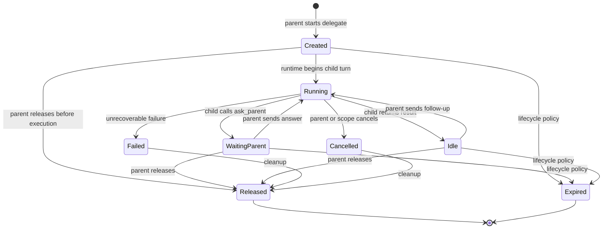

# Stateful subagent lifecycle, private memory, and parent-agent dialogue — Design

**Date:** 2026-08-18

**Status:** Draft — awaiting design review

**Scope:** Replace one-shot delegate execution with resumable logical subagent
runs that own private memory, can ask their direct parent agent for information,
and remain alive until explicitly released or reclaimed by lifecycle policy.

## Summary

Covalent currently exposes each configured delegate agent as an
`agent__<agent_name>` tool. Calling the tool starts a nested ReAct run and waits
for either a final answer or an error. The delegate reads the root chat session
history, but does not own or persist an independent conversation. Its internal
messages are deliberately excluded from session memory.

This becomes semantically incorrect when a delegate calls `ask_user`. The child
`input_required` is promoted to a root `input_required`, so the question is shown
directly to the user. On resume, the user's answer is attached to the parent's
`agent__<agent_name>` tool call. The parent continues, while the original delegate
run no longer exists and cannot consume the answer.

This design introduces a durable logical subagent run identified by
`delegate_run_id`. A run:

- owns private model memory separate from the root chat session;
- receives only an explicit task/context handoff from its parent;
- can pause with `ask_parent` and later resume at the same tool-call boundary;
- can return a result and remain idle for follow-up work;
- can be resumed only by its direct parent logical agent;
- shares the root execution/workspace scope while retaining the existing
  per-agent sandbox binding behavior;
- ends only when released, cancelled, expired, or failed terminally.

The root user-facing `ask_user` protocol remains unchanged. Delegates cannot call
it. If a delegate needs information that only the user can provide, it asks its
parent; the parent decides whether to answer, gather more evidence, or invoke
`ask_user` itself.

The implementation is a persisted state machine, not a resident Python task or a
permanently running model process. Waiting and idle subagents consume storage but
no active compute.



## Goals

1. Give every delegate invocation a stable identity and private, resumable model
   memory.
2. Let a subagent conduct multiple rounds of structured dialogue with its direct
   parent agent.
3. Prevent a subagent from directly producing user-facing HITL.
4. Let the parent reuse an idle subagent for follow-up work and explicitly release
   it when no longer needed.
5. Preserve waiting subagents while a root chat is paused for user input.
6. Support nested and concurrently running delegates without allowing cross-run
   memory or control access.
7. Preserve current session workspace collaboration, sandbox-profile behavior,
   trace visibility, and the backend/frontend contract boundary.
8. Provide bounded cleanup, quotas, and optimistic concurrency so forgotten or
   duplicated delegate operations cannot leak resources or corrupt memory.
9. Keep existing agents functional: `agent__<name>` remains the way a parent
   starts a new delegate.

## Non-goals

- Giving subagents direct access to the end user.
- Making hidden chain-of-thought visible to a parent, user, or operator.
- Creating an operating-system process, container, or Python task that stays
  resident for the whole logical lifetime.
- Introducing autonomous background execution after the root request has stopped.
- Automatically sharing the complete root chat transcript with a delegate.
- Adding cross-session, agent-level long-term memory. That is a separate product
  capability with different retention and privacy requirements.
- Changing skill or MCP permission assignment. A delegate continues to receive
  only the tools granted to its configured `AgentSpec`.
- Changing the v1 shared-workspace policy from the per-agent sandbox design.
- Allowing arbitrary users to inspect or control internal delegate runs through a
  new public API in the first delivery.
- Guaranteeing transactional merges for concurrent edits to shared workspace
  files.

## Terminology

### Root agent

The agent selected for the user-visible chat or public invocation. Only a root
agent can issue a user-facing `ask_user` request.

### Parent agent

The logical agent that started a delegate run. For a first-level delegate this is
the root agent; for nested delegation it is another delegate run. Parentage is
fixed for the lifetime of a delegate run.

### Delegate definition

The configured `AgentSpec` named in `delegate_agents`. It describes provider,
model, prompt, tools, skills, limits, and sandbox profile. It is not a running
instance and does not itself own conversation memory.

### Delegate run

One logical instance of a delegate definition, identified by a stable
`delegate_run_id`. Two calls to `agent__researcher` create two separate runs with
separate memory even though they use the same agent definition.

### Private delegate memory

The ordered `Message` transcript used to make model calls for exactly one
delegate run. It includes the initial task, child assistant messages, child tool
calls/results, `ask_parent`, parent replies, and follow-up tasks. It is not loaded
into the root agent's model context.

“Private” is a model-context boundary, not an audit secrecy promise. Authorized
operators may still see structured delegate activity and diagnostics. Raw hidden
reasoning is never added solely for this feature.

### Parent request

A structured request emitted when a delegate calls `ask_parent`. It pauses only
that delegate and is delivered as a normal tool result to the direct parent. It
must never be stored as the root session's pending user input.

### Release

A terminal lifecycle action indicating that the parent no longer intends to use
the run. Release prevents further sends, removes recoverable private runtime
state according to retention policy, and permits associated transient resources
to be reclaimed. Audit summaries may remain.

## Required invariants

- `delegate_run_id` identifies exactly one parent logical actor and one delegate
  agent definition.
- Only the direct parent logical actor may send to or release a delegate run.
- A delegate's model request loads only its own private memory plus its current
  system/tool configuration; it does not load root session memory.
- A delegate never emits a top-level `input_required` event.
- `ask_user` is unavailable and server-side rejected in delegated context.
- `ask_parent` is available only in delegated context.
- Resolving `ask_parent` appends a tool result matching the child's original
  `ask_parent` tool-call ID, then resumes that same delegate memory.
- Sending follow-up work to an idle delegate appends a new parent message to the
  existing private memory.
- Released, cancelled, failed-terminal, or expired runs cannot be resumed.
- At most one execution transition may mutate a delegate run at a time.
- Parent completion or user HITL does not silently rewrite a child request into a
  delegate final result.
- Root session deletion releases all descendant delegate runs.
- Stateless invocation cleanup releases all delegate runs created in that
  invocation.
- Delegate memory never overwrites root session `memory_messages`.
- Delegate runs share `execution_scope_id` and `workspace_scope_id` with their
  root, but memory ownership remains per `delegate_run_id`.

## Current behavior and failure mode

The current runtime has three relevant behaviors:

1. `_build_delegate_context()` copies the root `session_id` into the delegate.
2. `_persist_session_messages()` skips persistence when `metadata.delegated_by`
   exists, preventing concurrent delegates from overwriting root memory.
3. `_execute_delegate_tool_call()` captures child `input_required`, rewrites its
   tool name and ID to the parent's `agent__<name>` call, and returns it as the
   parent's blocking `ToolResult`.

The third behavior causes the root runtime to emit `input_required` and stop. On
resume, `_resume_tool_message()` creates a tool result for the parent delegate
tool call. The child cannot resume because its model messages and original
`ask_user` tool-call ID were not persisted as a child-owned continuation.

This design removes that promotion path. Child-to-parent questions become
ordinary typed delegate results; only root `ask_user` enters the existing
session-level HITL mechanism.

## Product behavior

### Starting a delegate

The parent continues to call the existing dynamic tool:

```json
{
  "name": "agent__researcher",
  "arguments": {
    "input": "Compare the two implementation options and identify risks."
  }
}
```

The runtime creates a new `delegate_run_id`, saves its ownership and initial
memory, and runs it until one of these boundaries:

- it returns an assistant result and becomes `idle`;
- it calls `ask_parent` and becomes `waiting_parent`;
- it fails terminally;
- the request is cancelled.

The parent receives a JSON tool result rather than an ambiguous plain string:

```json
{
  "delegate_run_id": "delegate_01K...",
  "agent_name": "researcher",
  "status": "idle",
  "output": "Option A is safer because ..."
}
```

For compatibility, model-facing prose in the tool description explains the
envelope. The transport remains a normal `ToolResult`; no provider-specific tool
protocol is introduced.

### Asking the parent

Delegated contexts expose this local tool:

```json
{
  "name": "ask_parent",
  "arguments": {
    "title": "Deployment target required",
    "questions": [
      {
        "header": "Target",
        "question": "Which deployment target should I evaluate?",
        "options": [
          {"label": "Docker", "description": "Evaluate the existing Docker backend."},
          {"label": "Kubernetes", "description": "Evaluate a future Kubernetes backend."}
        ]
      }
    ]
  }
}
```

The child runtime persists its assistant tool call and pending
`ParentInputRequest`, then returns control to the direct parent. The parent sees:

```json
{
  "delegate_run_id": "delegate_01K...",
  "agent_name": "researcher",
  "status": "waiting_parent",
  "request": {
    "id": "parent_question_01K...",
    "title": "Deployment target required",
    "questions": [...]
  }
}
```

This result is not a root `input_required`. The parent model receives it in the
normal next ReAct iteration and decides how to respond.

### Responding or sending follow-up work

All agents that can own delegates receive a lifecycle tool:

```json
{
  "name": "delegate_send",
  "arguments": {
    "delegate_run_id": "delegate_01K...",
    "input": "Evaluate Docker. Assume the default sandbox profile."
  }
}
```

Behavior depends on state:

- `waiting_parent`: `input` becomes the tool result for the pending child
  `ask_parent` call, preserving the child's tool-call protocol.
- `idle`: `input` becomes a new parent message in the child's private memory.
- `created`: the input may be appended before first execution if execution was
  deferred.
- `running`: reject with a typed conflict in v1; there is no concurrent mailbox.
- terminal state: reject with a typed gone/conflict result.

The response is the same `idle` / `waiting_parent` / `failed` envelope as the
initial `agent__<name>` call, allowing multiple rounds.

### Escalating to the user

If the direct parent cannot answer a child request, it escalates by one edge. A
root parent may call `ask_user`; a parent that is itself delegated calls
`ask_parent` on its own parent. The root case uses the existing HITL flow:

1. Parent receives child status `waiting_parent` with `delegate_run_id`.
2. Parent calls `ask_user` and the root session pauses.
3. The child remains durably `waiting_parent`; no child compute remains active.
4. The user answers and the parent resumes through the existing
   `resume_tool_result` mechanism.
5. The parent calls `delegate_send` with a curated answer.
6. The original child resumes after its `ask_parent` tool call.

The user sees a question authored or selected by the root agent, not an
unmediated subagent request. The parent may combine, rewrite, reject, or answer
multiple child questions before involving the user.

### Returning results without ending the lifecycle

When a delegate produces a normal final assistant response, the run becomes
`idle`, not `released`. Its output is returned to the parent, and its private
memory remains available for follow-up messages.

This distinction is intentional:

- model generation is complete for the current child turn;
- the logical subagent remains alive;
- no model call or coroutine remains running;
- the parent can either send follow-up work or release it.

### Releasing a delegate

Parents receive:

```json
{
  "name": "delegate_release",
  "arguments": {
    "delegate_run_id": "delegate_01K...",
    "reason": "Comparison is complete."
  }
}
```

Release is idempotent. It:

1. verifies direct-parent ownership;
2. marks the run `released` with timestamp and reason;
3. rejects future `delegate_send` calls;
4. clears pending continuation payloads and private memory according to the
   configured retention policy;
5. emits structured lifecycle activity;
6. permits future resource cleanup.

The initial delivery keeps a compact audit summary but deletes or expires raw
private memory after the retention window. Release does not delete files from the
shared workspace because other agents may depend on them.

### Discovering live children

Parents receive a read-only `delegate_list` tool returning only their direct
children and compact status metadata. This prevents the model from losing handles
after context compaction and supports cleanup:

```json
{
  "delegates": [
    {
      "delegate_run_id": "delegate_01K...",
      "agent_name": "researcher",
      "status": "waiting_parent",
      "last_activity_at": "2026-08-18T10:00:00Z",
      "summary": "Waiting for deployment target"
    }
  ]
}
```

It never returns private message history.

### Nested delegation

A delegate may start its configured children. The new child's direct parent is
the owning delegate run, not merely the parent's agent name. `ask_parent`,
`delegate_send`, `delegate_list`, and `delegate_release` always operate on that
direct relationship.

Questions travel one edge at a time. A grandchild cannot directly ask the root
agent or user. Its parent delegate may answer, gather evidence, or ask its own
parent.

The existing delegation-loop rule remains: an agent definition already present
in the ancestor chain cannot be started again below that chain. A configurable
maximum depth provides a second bound.

### Concurrent delegates

Multiple `agent__<name>` calls in one parent model response continue to execute
concurrently. Each creates a different `delegate_run_id`. If several children
pause for parent input, all return ordinary tool results in the same parent turn;
the parent can answer them individually or in parallel with multiple
`delegate_send` calls.

One waiting child does not pause or discard completed siblings. A terminal child
failure does not cancel siblings unless the parent explicitly chooses to do so.

## Memory model

### Memory scopes

Extend `RunContext` with an explicit memory identity instead of using
`session_id` for both ownership and model history:

```python
memory_scope_kind: Literal["session", "delegate", "none"] = "session"
memory_scope_id: str | None = None
delegate_run_id: str | None = None
parent_delegate_run_id: str | None = None
```

Resolution rules:

```text
root persistent chat:
  session_id        = chat session id
  memory_scope_kind = session
  memory_scope_id   = chat session id

delegate in persistent chat:
  session_id        = root chat session id (ownership/activity only)
  memory_scope_kind = delegate
  memory_scope_id   = delegate_run_id

root stateless invoke:
  session_id        = null
  memory_scope_kind = none
  memory_scope_id   = null

delegate in stateless invoke:
  session_id        = null
  memory_scope_kind = delegate
  memory_scope_id   = delegate_run_id
  rows are ephemeral and cleaned up with execution_scope_id
```

`memory_mode` remains accepted during migration, but new runtime code must branch
on the explicit memory scope. `session_id` continues to identify root transcript,
activity, ownership, and cleanup; it no longer determines child model memory.

### Initial handoff

A new delegate's private history starts with the exact `input` supplied by its
parent plus a small runtime-authored delegation capsule containing:

- direct parent agent name;
- delegate run ID;
- root execution/workspace identity where required by tools;
- the rule that `ask_parent` is the only clarification path;
- any explicit structured context passed by the parent.

It does not automatically copy root `memory_messages`, user attachments, or other
delegates' messages. The parent must include relevant context or shared workspace
paths in the task. This limits accidental disclosure and context growth.

### Parent replies

When resolving a pending `ask_parent`, the child receives:

```python
Message(
    role="tool",
    name="ask_parent",
    tool_call_id=pending_request.tool_call_id,
    content=<structured parent response>,
)
```

When sending follow-up work to an idle child, the child receives a new
`role="user"` message whose content is explicitly identified as a message from
the parent agent. The two cases must not be conflated because provider tool-call
validation requires the first form.

### Compaction

Each delegate applies the existing `ContextWindowManager` independently to its
private memory. Compaction never merges child history into the root session. A
delegate's compacted summary is stored in its own message stream.

Parent-facing results should be concise outputs or structured status envelopes.
They are normal parent tool results and therefore may be compacted as part of the
parent's history.

### Retention

Proposed defaults:

- active (`created`, `running`, `waiting_parent`, `idle`): retain private memory;
- released: retain raw memory for a short configurable recovery/audit window,
  then delete it while retaining status and a compact summary;
- failed/cancelled: same short retention unless security policy requires earlier
  deletion;
- expired: delete raw memory during expiry cleanup;
- root session deletion: cascade-delete run rows and raw child messages after
  stopping active execution.

Retention duration belongs in settings initially and may become workspace policy
later. There is no UI control in v1.

## Persistence design

### `delegate_runs`

Add an Alembic migration and ORM/repository support for:

```sql
CREATE TABLE delegate_runs (
    id                       VARCHAR(96) PRIMARY KEY,
    session_id               VARCHAR(255) NULL,
    execution_scope_id       VARCHAR(255) NOT NULL,
    workspace_scope_id       VARCHAR(255) NOT NULL,
    workspace_id             VARCHAR(255) NULL,
    root_agent_name          VARCHAR(255) NOT NULL,
    parent_agent_name        VARCHAR(255) NOT NULL,
    parent_delegate_run_id   VARCHAR(96) NULL,
    delegate_agent_name      VARCHAR(255) NOT NULL,
    origin_tool_call_id      VARCHAR(255) NULL,
    status                   VARCHAR(32) NOT NULL,
    pending_request_json     JSONB NULL,
    latest_output            TEXT NOT NULL DEFAULT '',
    summary                  TEXT NOT NULL DEFAULT '',
    error_json               JSONB NOT NULL DEFAULT '{}',
    release_reason           TEXT NOT NULL DEFAULT '',
    version                  INTEGER NOT NULL DEFAULT 1,
    created_at               TIMESTAMPTZ NOT NULL,
    updated_at               TIMESTAMPTZ NOT NULL,
    last_activity_at         TIMESTAMPTZ NOT NULL,
    released_at              TIMESTAMPTZ NULL,
    expires_at               TIMESTAMPTZ NULL,
    CONSTRAINT fk_delegate_run_session
        FOREIGN KEY (session_id) REFERENCES chat_sessions(id) ON DELETE CASCADE,
    CONSTRAINT fk_delegate_run_parent
        FOREIGN KEY (parent_delegate_run_id) REFERENCES delegate_runs(id)
        ON DELETE CASCADE,
    CHECK (status IN (
        'created', 'running', 'waiting_parent', 'idle',
        'released', 'cancelled', 'failed', 'expired'
    ))
);

CREATE INDEX ix_delegate_runs_session_id
    ON delegate_runs(session_id);
CREATE INDEX ix_delegate_runs_execution_scope_id
    ON delegate_runs(execution_scope_id);
CREATE INDEX ix_delegate_runs_parent
    ON delegate_runs(parent_delegate_run_id, parent_agent_name, status);
```

`session_id` is nullable for stateless invokes. `workspace_id` is the tenant
identity and remains distinct from `workspace_scope_id`, the shared filesystem
lifecycle identity.

There is intentionally no foreign key from agent-name fields to agent
configuration. On resume, the registry must resolve an enabled agent with the
saved internal name. If it no longer exists, the run transitions to `failed` with
a typed configuration error. Agent rename/delete services should warn about or
cancel active delegate runs in the same change slice.

### `delegate_messages`

Store private memory as ordered rows rather than a mutable JSON array so appends,
inspection, retention, and optimistic concurrency remain bounded:

```sql
CREATE TABLE delegate_messages (
    id                VARCHAR(255) PRIMARY KEY,
    delegate_run_id   VARCHAR(96) NOT NULL,
    role              VARCHAR(16) NOT NULL,
    content           JSONB NOT NULL,
    name              VARCHAR(255) NULL,
    tool_call_id      VARCHAR(255) NULL,
    tool_calls        JSONB NOT NULL DEFAULT '[]',
    reasoning_content TEXT NULL,
    position          INTEGER NOT NULL,
    created_at        TIMESTAMPTZ NOT NULL,
    CONSTRAINT fk_delegate_message_run
        FOREIGN KEY (delegate_run_id) REFERENCES delegate_runs(id)
        ON DELETE CASCADE,
    UNIQUE (delegate_run_id, position)
);
```

The row mirrors `core.types.Message`; conversion belongs in the repository. Do
not reuse `chat_messages`, which is a user-visible transcript limited to
user/assistant roles and has different retention semantics.

### Pending parent request

`pending_request_json` stores a `ParentInputRequest` including its child tool-call
ID. It is non-null only in `waiting_parent` and is cleared atomically when a
parent reply is appended. The state constraint is enforced in application logic
and covered by repository tests; a database check may be added if it remains
portable across supported databases.

### Concurrency

Every state mutation uses `version` for optimistic concurrency or a row lock in a
short transaction:

1. Load the run and verify direct-parent ownership.
2. Verify the expected state and version.
3. Transition to `running` and commit before model/tool execution.
4. Execute without holding a database transaction.
5. Append messages and commit the resulting state with expected version.

Concurrent `delegate_send` calls allow exactly one winner. The loser receives a
typed conflict and may reload status. Process-local locks may reduce duplicate
work but cannot replace database enforcement across API workers.

Cancellation must use a shielded finalization path to move a `running` row to a
recoverable state or `cancelled`; it must not leave rows permanently running.

## Core and runtime contracts

### New types

Add framework-independent types near the existing runtime types, splitting
parent requests from user requests deliberately:

```python
class ParentInputRequest(BaseModel):
    id: str
    delegate_run_id: str
    tool_call_id: str | None = None
    tool_name: Literal["ask_parent"] = "ask_parent"
    title: str
    questions: list[UserQuestion] = Field(default_factory=list)


class DelegateRunStatus(str, Enum):
    CREATED = "created"
    RUNNING = "running"
    WAITING_PARENT = "waiting_parent"
    IDLE = "idle"
    RELEASED = "released"
    CANCELLED = "cancelled"
    FAILED = "failed"
    EXPIRED = "expired"


class DelegateRunResult(BaseModel):
    delegate_run_id: str
    agent_name: str
    status: DelegateRunStatus
    output: str = ""
    request: ParentInputRequest | None = None
    error: dict[str, Any] = Field(default_factory=dict)
```

Do not add `ParentInputRequest` to `ToolResult.input_request`; that field retains
its user-facing HITL meaning. The delegate coordinator handles parent requests
before returning a normal `ToolResult` to the parent.

### Memory port

Generalize runtime memory loading behind a small port rather than teaching
`SessionStore` about delegates:

```python
class RuntimeMemoryStore(Protocol):
    async def load(self, scope_kind: str, scope_id: str) -> list[Message]: ...
    async def save(self, scope_kind: str, scope_id: str, messages: list[Message]) -> None: ...
```

An adapter routes `session` to the existing `SessionStore` and `delegate` to the
new delegate repository. During migration, `ReactAgentRuntime` may accept both
the old `session_store` and the new port, but all memory decisions must converge
in one helper. Application services remain independent of FastAPI and
`app.state`.

### Delegate coordinator port

Extract delegate lifecycle orchestration from the growing `react.py` into
`runtime/delegation.py`. Runtime code depends on a protocol; the concrete
application service owns persistence and lifecycle policy:

```python
class DelegateCoordinator(Protocol):
    async def start(...): ...
    async def send(...): ...
    async def list_children(...): ...
    async def release(...): ...
    async def finalize_scope(...): ...
```

The coordinator receives explicit actor identity from `RunContext`; it never
trusts a model-supplied parent name or workspace ID.

### Tool availability

Tool resolution becomes context-aware:

```text
root context:
  ask_user          allowed when configured
  ask_parent        absent
  delegate tools    allowed from AgentSpec.delegate_agents

delegated context:
  ask_user          absent and rejected if called by name
  ask_parent        always available as lifecycle infrastructure
  delegate tools    allowed from AgentSpec.delegate_agents
```

`ask_parent` is infrastructure, not an administrator-granted business tool. It
must be available to every active delegate so it can safely request missing
information. Server-side handler validation checks `delegate_run_id` and parent
identity from context.

### ReAct boundaries

Refactor child execution so these outcomes are explicit:

- normal assistant response → save memory, transition `idle`, return output;
- `ParentInputRequest` → save messages through the assistant tool call,
  transition `waiting_parent`, return request envelope;
- `UserInputRequest` in delegated context → invariant violation; return a tool
  error instructing the child to use `ask_parent`, without emitting root HITL;
- cancellation → persist a recoverable/cancelled state in `finally`;
- provider/tool failure → transition according to retryability and return a
  typed error envelope.

The parent sees each boundary as an ordinary tool result and continues its ReAct
loop. The current path that rewrites child `input_required` into the parent's
delegate tool-call ID is removed.

### Iteration and token limits

Each child turn retains the configured agent `max_iterations`. A resumed turn
gets a new per-turn iteration budget but continues using the same compacted
private memory. Add lifecycle-level limits:

- maximum active child runs per logical parent;
- maximum total delegate runs per execution scope;
- maximum delegation depth;
- maximum parent/child exchanges per run;
- maximum private-memory size before mandatory compaction;
- idle and waiting TTLs.

Limit failures are structured and visible to the parent. They do not become
user-facing errors unless the root agent chooses to report them.

## Application-layer design

Add `application/services/delegate_service.py` responsible for:

- creating a run after validating the configured parent→delegate edge;
- assigning root, parent, execution, workspace, and tenant ownership;
- state transitions and direct-parent authorization;
- constructing the initial delegation capsule;
- resolving `ask_parent` replies correctly;
- idle follow-up messages;
- release, cancellation, expiration, and scope cleanup;
- quota and depth enforcement;
- active-run checks during agent rename/delete;
- compact list/status summaries for parent tools and observability.

The service receives repositories, registry/config access, a clock/ID generator,
and runtime ports explicitly. It must not import `covalent.api.*`, FastAPI,
`Request`, or read `app.state`.

Add typed application errors for:

- unknown delegate run;
- parent ownership mismatch;
- invalid state transition;
- concurrent modification;
- delegate definition missing/disabled;
- quota/depth exceeded;
- expired/released run.

API routes map these only if an operator endpoint is later exposed. Normal model
tool execution serializes them into safe `ToolResult` envelopes.

## Session, invocation, and cleanup behavior

### Persistent chat

Delegate runs survive:

- parent model iterations;
- parent `ask_user` pauses;
- HTTP/SSE reconnects;
- later user turns in the same chat session;
- process restarts.

The parent can recover handles with `delegate_list`. Session deletion releases
active descendants, stops relevant transient execution, and cascades database
rows.

### Stateless invocation

Delegates may hold private memory while the root invocation is running, but may
not outlive the invocation. The public invoke service calls
`finalize_scope(execution_scope_id)` in a cancellation-safe `finally` block,
releasing all descendants before sandbox/workspace cleanup.

### Non-stream `/run`

Child `ask_parent` no longer requires an external pause, so it works through the
normal synchronous parent loop. Root `ask_user` remains unsupported by the
non-stream endpoint unless a separate API contract is added. The route should
return a typed conflict instead of the current generic “completed without a final
response” failure; that cleanup is adjacent but not a prerequisite for internal
parent dialogue.

### Edit and resend

Editing history can invalidate the parent context that created live delegates.
Until delegate runs are associated with a durable conversation branch, any
server-side transcript truncate/replace operation must release all active
delegate runs for that session before saving the replacement. This is conservative
but prevents stale private state from leaking into the regenerated branch.

A future branch-aware implementation may store `origin_user_message_id` and
release only descendants created after the edit boundary.

### Agent disable, rename, and delete

- disabling a delegate definition blocks new starts and new sends;
- an already-running model call may finish, after which the run becomes failed or
  idle according to the configuration snapshot policy;
- v1 resolves current agent configuration on every send rather than snapshotting
  model/provider credentials;
- rename/delete must either migrate active run references transactionally or
  reject with a conflict listing active runs;
- force deletion explicitly cancels/releases affected runs before removing
  configuration.

## Sandbox and workspace behavior

The new logical lifecycle does not change the per-agent sandbox profile design:

- child context inherits root `execution_scope_id` and `workspace_scope_id`;
- child context does not inherit the parent's `sandbox_instance_id`;
- binding resolution continues to use `(execution_scope_id, agent_name)`;
- two logical runs of the same delegate definition therefore have separate
  private memory but may use the same agent sandbox instance in v1;
- all collaborating agents retain read/write access to the shared execution
  workspace;
- idle/waiting logical runs do not keep a container alive; normal sandbox idle
  reaping may remove it and recreate it on resume.

Changing sandbox identity to `(execution_scope_id, delegate_run_id)` would provide
stronger process/cache isolation but conflicts with the already selected
per-agent instance model and is out of scope. It can be added later without
changing delegate memory identity.

Releasing one delegate run does not stop the shared per-agent sandbox instance if
another live run of the same agent may still use it. Scope cleanup and the normal
sandbox reaper remain authoritative.

## Events and frontend behavior

### SSE/activity events

Keep existing `delegate_*` trace decoration and add lifecycle events carrying
`delegate_run_id`, direct parent metadata, status, and safe summaries:

- `delegate_created`
- `delegate_running`
- `delegate_waiting_parent`
- `delegate_resumed`
- `delegate_idle`
- `delegate_released`
- `delegate_cancelled`
- `delegate_expired`
- `delegate_failed`

The existing `delegate_input_required` event is deprecated for lifecycle
questions. A child `ask_parent` produces `delegate_waiting_parent`; it never
produces top-level `input_required`.

Only top-level `input_required` is persisted as a pending user question and
processed by `_extract_pending_user_input()`. Delegate lifecycle events remain
trace activity and cannot block arbitrary new user messages by themselves.

### Chat workspace

The existing trace panel displays delegate lifecycle transitions using the
current light control-plane vocabulary. Minimum v1 UI behavior:

- show the child agent name and shortened `delegate_run_id`;
- distinguish `waiting for parent`, `running`, `idle`, and terminal states;
- show safe question/result summaries in trace details;
- do not render `delegate_waiting_parent` with the user answer form;
- continue rendering only root `input_required` as an interactive prompt;
- preserve grouping by delegate run when multiple calls target the same agent.

The user does not directly send messages to or release delegates in v1. Those are
model/runtime operations. An operator-facing inspector can be designed later.

### Contract types

Update `frontend/lib/types.ts` for new delegate activity payloads in the same
slice as backend event schemas. No new general fetch logic belongs in components;
any future management endpoints must use `frontend/lib/client-api.ts`.

## Security and privacy

- Never accept parent identity, root session, workspace, or tenant IDs from model
  tool arguments.
- Check direct-parent ownership for list/send/release using `RunContext` identity.
- A sibling delegate cannot discover or control another sibling's children.
- Do not include private delegate messages in parent tool results, root transcript,
  downloadable traces, or model-call metadata by default.
- Existing model-call observability may retain provider request/response payloads;
  access and retention must remain at least as restrictive as current trace data.
- `ask_user` must be enforced server-side, not merely omitted from the tool schema.
- Shared workspace files are not private delegate memory. Agents should treat
  shared paths as intentionally visible to collaborators.
- Release/expiry retention jobs must delete raw messages without deleting audit
  identity, status, timestamps, and compact non-sensitive summaries required for
  operations.

## Failure and recovery semantics

### Provider or tool error

Retryable errors leave enough saved memory to retry the current child turn through
an explicit parent send. Unrecoverable configuration/protocol errors transition
to `failed`. The parent receives a structured error and may release or replace the
run.

### Process restart

`running` rows may be abandoned by worker termination. Store a run lease/heartbeat
or transition timestamp. On startup or next access, rows whose execution lease
expired move to a recoverable state:

- if the last committed memory ended at a clean turn boundary, return to `idle` or
  `waiting_parent`;
- if model/tool side effects may be in flight, mark `failed` with an
  `execution_interrupted` error rather than silently replaying them.

V1 must not automatically repeat an unknown external side effect.

### Client disconnect

SSE disconnect cancellation follows existing request cancellation behavior. The
delegate coordinator finalizer commits the last safe boundary and releases its
execution lease. Persistent logical state remains available unless the root
invocation is stateless.

### Parent disappears

Deleting a root session cascades cleanup. Releasing/cancelling a parent delegate
recursively releases all descendants before finalizing the parent. TTL cleanup
also walks descendants so no child remains owned by a terminal parent.

### Expiry and quotas

A periodic application-owned cleanup service expires idle/waiting runs past TTL.
If no scheduler exists in the initial delivery, cleanup runs opportunistically on
session load/start/send plus process startup, using bounded batches. Expiry is
idempotent and safe across workers.

## Compatibility and migration

### Compatibility guarantees

- Agent configuration keeps `delegate_agents` unchanged.
- `agent__<name>` still starts a delegate and accepts required `input`.
- Completed delegate output remains available as a parent tool result, now inside
  a typed JSON envelope.
- Existing `delegate_*` trace events continue where applicable and gain
  `delegate_run_id`.
- Root `ask_user`, `input_required`, question-response metadata, and user-facing
  UI behavior remain unchanged.
- No environment-only persistence flow is introduced.

### Intentional behavior changes

- Delegates no longer load root chat memory implicitly.
- Delegate results become structured envelopes rather than bare text.
- A normal child answer leaves the run `idle` until release/expiry.
- Child clarification goes to the parent, not directly to the user.
- Parent prompts gain lifecycle tools and guidance to release unused runs.

Model prompts must explicitly explain these changes so existing parent agents do
not quote JSON envelopes blindly or forget cleanup.

### Rollout order

Use a feature flag during development:

```text
AGENT_FRAMEWORK_STATEFUL_DELEGATES_ENABLED=false
```

Suggested rollout:

1. Land schemas, repository, migration, state-machine tests, and cleanup with the
   flag off.
2. Add explicit memory scopes and child persistence without changing default
   delegate behavior.
3. Add `ask_parent`, lifecycle tools, and structured results behind the flag.
4. Update trace/frontend rendering and end-to-end HITL coverage.
5. Enable by default for development, observe lifecycle/error metrics, then
   remove the legacy child-`input_required` promotion path.
6. Remove the feature flag after one compatibility release.

No web-lifespan migration is added; operators continue to run
`uv run python main.py migrate` explicitly.

## Implementation slices

### Slice 1 — State model and persistence

- Add core lifecycle/request/result types.
- Add `DelegateRunRow` and `DelegateMessageRow` plus Alembic migration.
- Add repository ports and PostgreSQL/in-memory implementations.
- Implement atomic transition, ownership, version, list, and scope-cleanup tests.

### Slice 2 — Explicit memory ownership

- Extend `RunContext` with memory scope and logical parent identity.
- Add the runtime memory adapter.
- Route root memory to `SessionStore` and child memory to delegate storage.
- Remove delegate loading of root session messages.
- Preserve current root session and context-window tests.

### Slice 3 — Lifecycle coordinator and tools

- Extract delegate orchestration from `react.py`.
- Keep `agent__<name>` for start.
- Add `ask_parent`, `delegate_send`, `delegate_list`, and `delegate_release`.
- Add server-side context/ownership enforcement.
- Add structured `DelegateRunResult` serialization and system-prompt guidance.

### Slice 4 — HITL and resume correctness

- Remove child `input_required` promotion.
- Persist the child `ask_parent` tool-call boundary.
- Resume it with a matching child tool result.
- Verify the root can ask the user, resume, and then continue the same child.
- Return a typed error for root `ask_user` through non-stream `/run`.

### Slice 5 — Events and frontend

- Add event constants and payload schemas.
- Persist safe lifecycle activity.
- Update frontend types and trace grouping by `delegate_run_id`.
- Ensure only root `input_required` creates the user answer UI.

### Slice 6 — Cleanup and management integration

- Add TTL/quota enforcement and orphan recovery.
- Release descendants on parent release/cancel.
- Release all descendants on session deletion, stateless-run finalization, and
  transcript replacement.
- Integrate active-run checks with agent disable/rename/delete.
- Add lifecycle metrics and operational logging.

## Testing strategy

### Runtime unit tests

- A delegate final answer produces `idle` with a stable `delegate_run_id`.
- Two calls to the same delegate definition have isolated memories.
- A delegate never receives unrelated root chat history.
- `ask_parent` returns `waiting_parent` to the parent without top-level
  `input_required`.
- `delegate_send` resolves the exact child tool-call ID and child execution
  continues from its saved history.
- Sending to `idle` appends a parent follow-up message.
- Sending to `running` or terminal state returns the correct typed error.
- `ask_user` is omitted and rejected in delegated context.
- `ask_parent` is omitted and rejected in root context.
- Nested questions move one parent edge at a time.
- Delegation loop and maximum-depth checks remain effective.
- Parallel delegates retain distinct run IDs and isolated results/failures.
- Context compaction occurs independently for root and child memory.

### Persistence tests

- Run/message creation and ordered loading round-trip every `Message` field.
- Concurrent sends have exactly one successful transition.
- `waiting_parent` and pending request are committed atomically.
- Resume clears the pending request and appends the matching tool result.
- Release is idempotent and blocks later sends.
- Session cascade and stateless scope cleanup remove descendants.
- TTL cleanup is bounded, idempotent, and recursively handles descendants.
- Interrupted `running` lease recovery never replays unknown side effects.
- Real PostgreSQL integration tests run when `TEST_DATABASE_URL` is set.

### End-to-end backend tests

- Parent starts child → child asks parent → parent answers → child completes →
  parent returns final response.
- Parent starts child → child asks parent → parent calls `ask_user` → session
  pauses → user answers → parent resumes child → child continues with pre-pause
  memory intact.
- The activity log contains `delegate_waiting_parent` and one root
  `input_required`, not a child-generated pending user question.
- A process/runtime reconstruction can resume a persisted waiting child.
- Session deletion, edit-and-resend, and stateless invoke cleanup release runs.
- Unauthorized parent/sibling attempts to send/release are rejected.
- Agent disable/delete behavior matches the specified conflicts.

### Frontend validation

- Delegate lifecycle events group by run ID even for repeated calls to one agent.
- `delegate_waiting_parent` appears as trace only.
- Root `input_required` remains the only interactive question card.
- Reloading a session preserves root pending-user state and delegate trace.
- Existing chat layout, editing, attachment, and multi-panel behavior remain
  unchanged.

### Required gates

Run the narrowest tests throughout, then:

```bash
uv run python -m pytest tests/
uvx ruff check --select F src/ main.py
cd frontend && pnpm exec tsc --noEmit
cd frontend && pnpm lint
```

Run Alembic upgrade/downgrade validation explicitly against PostgreSQL. The
application-boundary import guard must remain green.

## Observability

Add counters/gauges for:

- created, resumed, released, cancelled, failed, and expired delegate runs;
- active runs by state;
- parent-question round trips and wait duration;
- run lifetime and idle duration;
- quota/depth rejections;
- optimistic-concurrency conflicts;
- orphaned-running recovery outcomes;
- private-memory message/token size and compaction count.

Structured logs include `delegate_run_id`, `parent_delegate_run_id`, root
`session_id`/`execution_scope_id`, parent/delegate agent names, and transition.
They must not include raw private messages or user answers by default.

## Acceptance criteria

The design is complete when all of the following are true:

1. A delegate can ask its direct parent and resume from the same persisted
   `ask_parent` tool call after receiving a reply.
2. No delegate can directly create a root pending-user question.
3. A parent can involve the user and later resume the still-existing child.
4. Each delegate run has isolated, durable memory keyed by `delegate_run_id`.
5. Parent and child model histories do not overwrite or implicitly merge.
6. A child result leaves it available for follow-up until release or lifecycle
   cleanup.
7. Direct-parent authorization, concurrency, quotas, nested delegation, and
   terminal states are covered by tests.
8. Persistent chat, stateless invocation, session deletion, and edit/resend have
   explicit cleanup behavior.
9. Existing sandbox/workspace semantics and the application import boundary are
   preserved.
10. Frontend trace clearly distinguishes internal parent waiting from user HITL.

## Deferred follow-ups

- User/operator UI for inspecting, messaging, cancelling, or retaining delegate
  runs manually.
- Cross-session named subagents with durable agent-level memory.
- Event-driven background delegates and mailboxes that accept sends while
  `running`.
- Branch-aware delegate retention for edit-and-resend.
- Per-delegate-run sandbox instances and private/read-only workspace mounts.
- Parent-configurable memory sharing policies beyond explicit task handoff.
- Durable task queues for continuing execution when no root HTTP request is
  active.

## Design decisions requiring confirmation

This draft recommends the following defaults for implementation review:

1. A child normal response transitions to `idle`, not terminal completion.
2. Delegate runs may survive across user turns in a persistent chat.
3. Parent release is explicit, backed by TTL/quota safety cleanup.
4. Child memory is private by default and does not inherit root chat history.
5. `ask_parent` and lifecycle controls are infrastructure tools, not optional
   administrator-granted tools.
6. Existing per-agent sandbox bindings remain unchanged; memory is per run.
7. Transcript replacement conservatively releases all active runs in the
   affected session for v1.

Approval of these seven decisions is the prerequisite for converting this design
into a task-by-task implementation plan.
